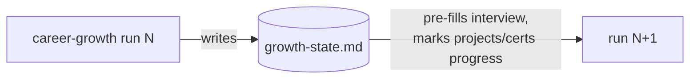

# growth-state.md — contract

The single machine-readable state file the `career-growth` skill maintains in the
user's **career repo** (ADR 0049). One YAML document in a fenced block inside
`growth-state.md`. The skill owns every field; the user may hand-edit `cadence_months`.



## Schema

```yaml
version: 1                      # contract version — bump only via a new ADR
last_run: 2026-07-31            # ISO date of the last completed full run
cadence_months: 3               # suggested review cadence (user-adjustable)
next_review_due: 2026-10-31     # last_run + cadence_months; the skill prints it at wrap-up
chosen_moat: "<one-line moat statement>"   # copied from moat.md when the user picks (Station 4)
moat_adopted_on: 2026-07-31     # date the current moat was picked
target_certs:                   # Station 5 output — one entry per live-verified cert
  - code: PL-400                # vendor exam code, exactly as the registry lists it
    name: Microsoft Power Platform Developer
    status: studying            # planned | studying | scheduled | passed | retired-blocked
    verified_on: 2026-07-31     # date the live registry check last passed
    registry_url: https://learn.microsoft.com/credentials/certifications/…
mini_projects:                  # Station 5 output — one entry per mini project
  - name: <kebab-slug>
    for_cert: PL-400            # exam this project prepares for; "none" → non-cert milestone
    milestone: "pass PL-400"    # pass/fail milestone (exam pass, or the explicit non-cert milestone)
    exam_objectives:            # the objective-domain strings this project exercises
      - "Extend the platform"
    status: planned             # planned | in-progress | done
    published_url: null         # public repo URL when published; null when private/unpublished
```

## Rules

- **Full run every time (ADR 0050):** re-runs never skip a station; this file only
  pre-fills the interview and carries project/cert progress — it is never a reason
  to skip fresh evidence gathering.
- `status: retired-blocked` is set only when the registry was reachable **and**
  listed the cert as retired (ADR 0048 rule 1); the skill must then propose a
  replacement. An unreachable registry leaves the cert's status unchanged.
- The skill writes this file's `last_run` (and the round's other fields)
  once the user has **approved** the career-repo commit but **before** that
  commit runs, so `growth-state.md` is one of the five files the commit
  covers — never written merely after the four document artifacts exist, and
  never left for a follow-up commit. `last_run` means "a committed round
  exists in the career repo": a crashed run and a commit the user declines
  both leave `last_run` (and the rest of this file) unchanged.
- This file is a machine-readable state file and is exempt from the diagram
  convention — the four document artifacts carry the diagrams, the same way the
  CONTEXT.md glossary is exempt.
