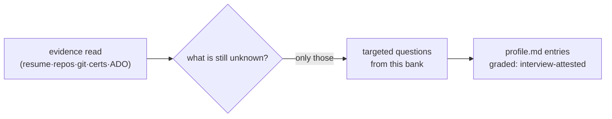

# INVENTORY station — gap-fill interview bank

Questions for the short targeted interview (ADR 0046 source 4). Ask **only**
questions whose answer the evidence cannot show, and **pre-fill from the previous
`profile.md`** so a returning user corrects instead of re-answering (ADR 0050).
One question at a time; skip any section the evidence already covers.

## Non-git work

- What delivered work of the last 2 years left no git trace (config, ops,
  migrations, integrations, admin, reports)?
- What systems do you operate or support that you did not build?

## Soft skills & languages

- Which human languages do you work in, at what level (meetings / writing / docs)?
- Have you led anything — a feature, a rollout, a person, a vendor call?
- What do colleagues come to you for?

## Domain knowledge

- Which business domains have you shipped into (e.g. shipping/logistics, finance),
  and how deep — vocabulary-level, process-level, or design-level?
- Which regulations, standards, or industry practices do you know from the inside?

## Constraints & preferences

- Hours per week you can actually study, sustainably?
- Exam budget per quarter (certs cost money) — any employer sponsorship?
- Remote / relocation constraints across the target rings?
- Anything you refuse to work on, regardless of market demand?

## Grading rule

Every answer becomes a `profile.md` entry graded **interview-attested** — weaker
than repo/cert evidence, stronger than resume-only. Never let an interview answer
upgrade a resume-only claim to *verified*; only artifacts do that.
