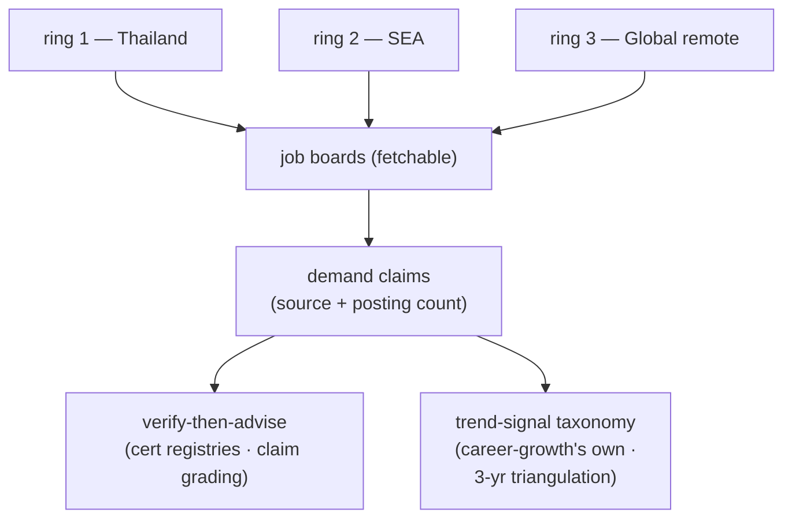

# MARKET station — source list and trend taxonomy

The fixed per-ring source list that keeps MARKET a single-session stage
(ADR 0047), plus career-growth's own trend-signal taxonomy for the 3-year
triangulation. Fetchability shifts — treat "known blocked" entries as *skip
immediately*, and when a listed board starts returning 403, try the
alternates before reporting a metric unavailable, then record the
fetchability change in `market-report.md` in the user's career repo and tell
the user to update this reference file in the plugin **source** if the
change looks permanent.

## Ring 1 — Thailand

| Source | Status | Notes |
|---|---|---|
| LinkedIn Jobs (location: Thailand) | fetchable | primary demand signal |
| Indeed Thailand | fetchable | cross-check counts |
| JobsDB (th.jobsdb.com) | **known blocked (403, 2026-07-31)** | skip; do not burn time retrying |

## Ring 2 — SEA (incl. Singapore)

| Source | Status | Notes |
|---|---|---|
| LinkedIn Jobs (SG / MY / VN / ID / PH) | fetchable | primary |
| Indeed Singapore | fetchable | cross-check |
| NodeFlair / regional boards | verify at run time | use only if they serve automated fetch |

## Ring 3 — Global remote

| Source | Status | Notes |
|---|---|---|
| LinkedIn Jobs (remote filter) | fetchable | primary |
| Indeed (remote filter) | fetchable | cross-check |
| We Work Remotely / RemoteOK / Hacker News "Who's hiring" | verify at run time | volume smaller; good rarity signal for niche combos |

## Trend-signal taxonomy (career-growth's own)

The 3-year outlook requires triangulation — at least three of these signal
types before a trend claim may be stated as anything above `Directional`:

- **Vendor roadmaps** — public roadmap statements or announcements from the
  product vendor about multi-year direction.
- **Industry and developer surveys** — Stack Overflow, JetBrains, vendor-run
  or independent-analyst surveys, read for direction, not headline.
- **Posting-trend deltas** — `git diff` / `git log` of `market-report.md`
  across runs in the user's **career repo**, comparing this round's demand
  counts to the prior round's. On a first run there is no prior round to
  diff against — record the signal as **"not yet available"** rather than
  fabricating a trend from a single data point.
- **AI-absorption assessment** — for each candidate skill, an explicit
  argument for what share of the work current AI tooling already does and
  how that share is likely to move over three years. This feeds the
  four-test moat's `durable` verdict (Station 3).

## Outside this file

The vendor certification **retirement-registry list** and the **four-grade
claim scale** (Verified-primary / Corroborated / Directional / Unverified)
are `verify-then-advise`'s method — see that skill for where to verify a
cert and how to grade a market claim. The per-ring board list above and the
trend-signal taxonomy above are career-growth's own; this file's remaining
job is bounding MARKET's research cost to a single session (ADR 0047).

Once a cert clears that verification, carry the result forward to Station
5's wrap-up write, where it is recorded as `verified_on` + `registry_url` in
`growth-state.md` — that part of the state contract is career-growth's own.
