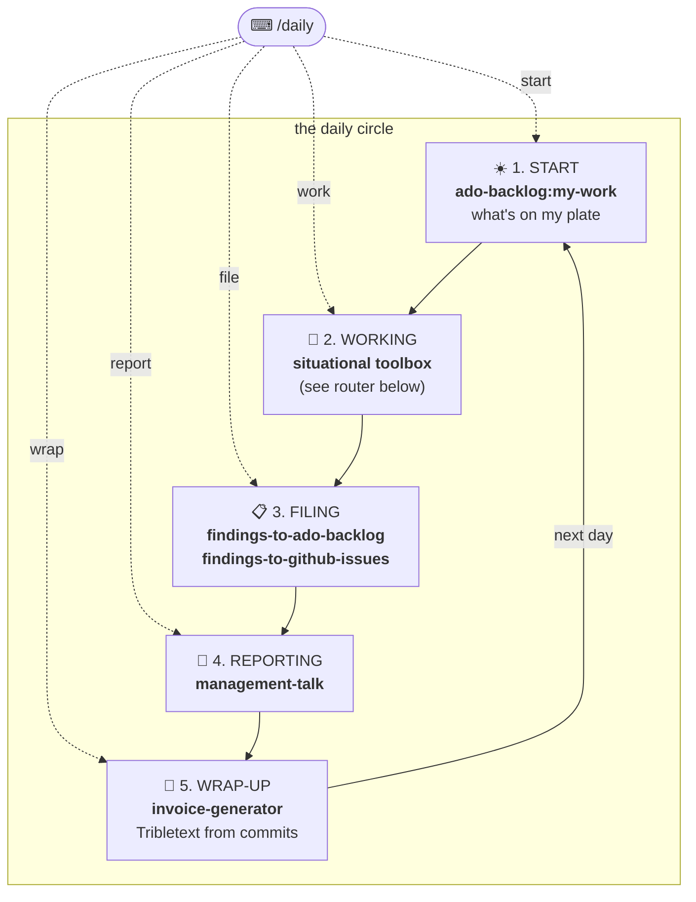
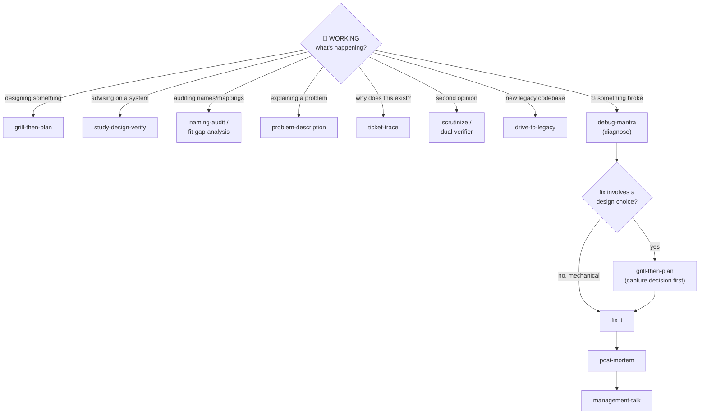

# PLAYBOOK — the daily-work arc

One page: **what to reach for, when.** The only command you must remember is
**`/daily`** (installed as `/dev-workflows:daily` — typing `/daily` finds it via
autocomplete). Everything else is reachable from there or from this page.

## The daily circle



| Station | Say | Skill that runs |
|---|---|---|
| 1. START | `/daily start` | `ado-backlog:my-work` — ADO task hub (GitHub view on request) |
| 2. WORKING | `/daily work` | the situational router below |
| 3. FILING | `/daily file` | `findings-to-ado-backlog` or `findings-to-github-issues` |
| 4. REPORTING | `/daily report` | `management-talk` |
| 5. WRAP-UP | `/daily wrap` | `invoice-generator` — run it every day; it builds from commits |

## WORKING — the situational router



| When… | Reach for |
|---|---|
| designing something new | `grill-then-plan` |
| something broke | `debug-mantra`, then the debug chain below |
| advising on how a system should work | `study-design-verify` |
| auditing names / labels / mappings | `naming-audit` / `fit-gap-analysis` |
| explaining a complex problem | `problem-description` |
| "why does this code/ticket exist?" | `ticket-trace` |
| second opinion on a plan / PR / change | `scrutinize` / `dual-verifier` |
| unfamiliar legacy codebase | `drive-to-legacy` |

### The debug chain (ADR 0003)

```
something broke → debug-mantra (diagnose)
   ├─ fix is mechanical/obvious   → fix → post-mortem → management-talk
   └─ fix involves a design choice → grill-then-plan (document the decision FIRST)
                                     → fix → post-mortem → management-talk
```

The chain flows into REPORTING by itself: post-mortem's output is what
management-talk reshapes for the channel.

## /daily usage

- **`/daily`** — shows the 5-station menu. Pick a number.
- **`/daily <station>`** — jumps straight there: `start` · `work` · `file` ·
  `report` · `wrap` (synonyms accepted: `morning`, `stuck`, `findings`, `status`,
  `done`). An unrecognized word falls back to the menu — never an error.

## Maintenance rule

**Every new skill adds one row to this file, in the same commit.** A skill missing
from the playbook is invisible (see the convention in [CLAUDE.md](CLAUDE.md), and
ADR [0001](docs/adr/0001-playbook-plus-daily-router.md)).
