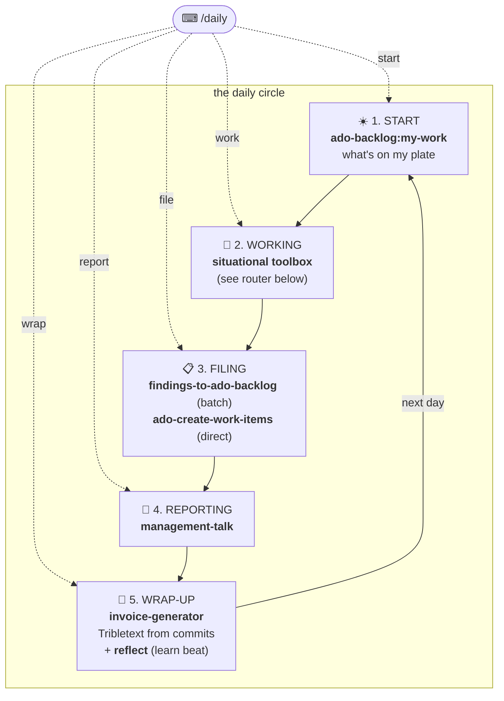
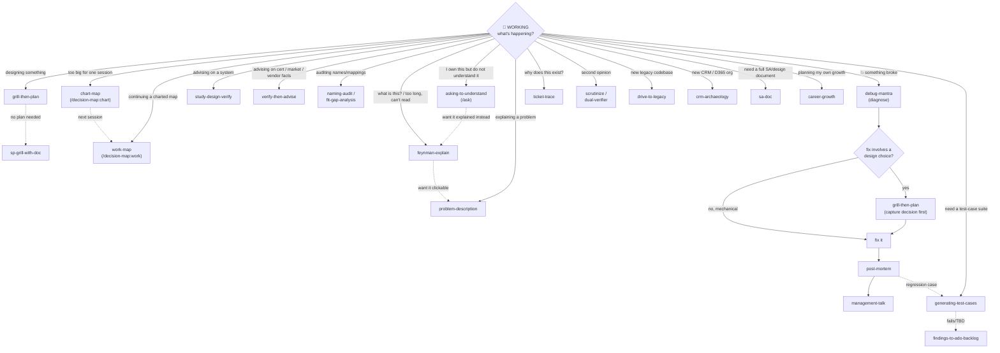

# PLAYBOOK — the daily-work arc

One page: **what to reach for, when.** The only command you must remember is
**`/daily`** (installed as `/dev-workflows:daily` — typing `/daily` finds it via
autocomplete). Everything else is reachable from there or from this page.

## The daily circle


```mermaid
flowchart TD
    DAILY(["⌨ /daily"]) -.start.-> START
    DAILY -.work.-> WORK
    DAILY -.file.-> FILE
    DAILY -.report.-> REPORT
    DAILY -.wrap.-> WRAP

    subgraph CIRCLE [" the daily circle "]
        START["☀️ 1. START<br/><b>ado-backlog:my-work</b><br/>what's on my plate"]
        WORK["🔧 2. WORKING<br/><b>situational toolbox</b><br/>(see router below)"]
        FILE["📋 3. FILING<br/><b>findings-to-ado-backlog</b> (batch)<br/><b>ado-create-work-items</b> (direct)"]
        REPORT["📣 4. REPORTING<br/><b>management-talk</b>"]
        WRAP["🌙 5. WRAP-UP<br/><b>invoice-generator</b><br/>Tribletext from commits<br/>+ <b>reflect</b> (learn beat)"]

        START --> WORK
        WORK --> FILE
        FILE --> REPORT
        REPORT --> WRAP
        WRAP -- next day --> START
    end
```

| Station | Say | Skill that runs |
|---|---|---|
| 1. START | `/daily start` | `ado-backlog:my-work` — ADO task hub (GitHub view on request) |
| 2. WORKING | `/daily work` | the situational router below |
| 3. FILING | `/daily file` | `findings-to-ado-backlog` (batch) or `ado-create-work-items` (direct) — GitHub twins on request |
| 4. REPORTING | `/daily report` | `management-talk` |
| 5. WRAP-UP | `/daily wrap` | `invoice-generator` — run it every day; it builds from commits — then the optional `reflect` learn beat |

## WORKING — the situational router


```mermaid
flowchart TD
    WORK{"🔧 WORKING<br/>what's happening?"}

    WORK -- designing something --> GTP["grill-then-plan"]
    GTP -. no plan needed .-> SGWD["sp-grill-with-doc"]
    WORK -- too big for one session --> DMAP["chart-map<br/>(/decision-map:chart)"]
    WORK -- continuing a charted map --> DMW["work-map<br/>(/decision-map:work)"]
    DMAP -. next session .-> DMW
    WORK -- advising on a system --> SDV["study-design-verify"]
    WORK -- advising on cert / market / vendor facts --> VTA["verify-then-advise"]
    WORK -- auditing names/mappings --> NA["naming-audit /<br/>fit-gap-analysis"]
    WORK -- what is this? / too long, can't read --> FE["feynman-explain"]
    WORK -- I own this but do not understand it --> ATU["asking-to-understand<br/>(/ask)"]
    ATU -. want it explained instead .-> FE
    FE -. want it clickable .-> PD
    WORK -- explaining a problem --> PD["problem-description"]
    WORK -- why does this exist? --> TT["ticket-trace"]
    WORK -- second opinion --> SC["scrutinize /<br/>dual-verifier"]
    WORK -- new legacy codebase --> DTL["drive-to-legacy"]
    WORK -- new CRM / D365 org --> CA["crm-archaeology"]
    WORK -- need a full SA/design document --> SAD["sa-doc"]
    WORK -- planning my own growth --> CG["career-growth"]

    WORK -- 💥 something broke --> DM["debug-mantra<br/>(diagnose)"]
    DM --> Q{"fix involves a<br/>design choice?"}
    Q -- no, mechanical --> FIX["fix it"]
    Q -- yes --> GTP2["grill-then-plan<br/>(capture decision first)"]
    GTP2 --> FIX
    FIX --> PM["post-mortem"]
    PM --> MT["management-talk"]
    WORK -- need a test-case suite --> GTC["generating-test-cases"]
    PM -. regression case .-> GTC
    GTC -. fails/TBD .-> FILEHINT["findings-to-ado-backlog"]
```

| When… | Reach for |
|---|---|
| designing something new | `grill-then-plan` |
| designing something new, but you do NOT need a written plan afterward | `sp-grill-with-doc` — the same domain-aware grilling (terminology challenged, contradictions with the real code surfaced, `CONTEXT.md` and ADRs kept current as decisions land), stopping before the plan hand-off. Despite the prefix it is **not** a vendored superpowers copy |
| an effort too big for one session (foggy, multi-session) | `chart-map` (`/decision-map:chart`) — chart the destination, the decision tickets and the fog; the map lands in `docs/decision-map/`, or on GitHub Issues as an issue + sub-issues |
| continuing a decision map already charted | `work-map` (`/decision-map:work`) — claim and resolve exactly one decision, then stop |
| something broke | `debug-mantra`, then the debug chain below |
| advising on how a system should work | `study-design-verify` |
| advising on cert / market / vendor facts (outside the codebase) | `verify-then-advise` |
| auditing names / labels / mappings | `naming-audit` / `fit-gap-analysis` |
| "what is this / how does it work?" — or an answer came back too long to read | `feynman-explain` (`/feynman`) — fixed short card: plain explanation, the fuzzy parts named, gaps filled from real evidence, 30-second line |
| work you OWN but do not understand — a map/plan/pipeline an AI built for you, or "ถามให้คิดหน่อย" / "grill me" | `asking-to-understand` (`/ask`) — the Socratic side of `/feynman`: one evidence-grounded question per turn, symptom pushed to mechanism, stops when you state the rule |
| the agent's *last message* lost you — "wait", "หา?", "งง", "say that again" | `wait-what` (`/wait-what`) — re-pitches that one message with a little context, in ASD-STE100 Simplified Technical English, using `CONTEXT.md`'s ubiquitous language. Vendored verbatim from [mattpocock/skills](https://github.com/mattpocock/skills) (MIT); manual invocation only |
| explaining a complex problem | `problem-description` |
| "why does this code/ticket exist?" | `ticket-trace` |
| second opinion on a plan or a local diff | `scrutinize` (plans / local diffs) / `dual-verifier` (completed work) |
| reviewing a GitHub pull request (by number or URL) | `review-pr` — context, safe workspace, `scrutinize`, then send-back / fix-it / chat-only. A local uncommitted diff goes to `scrutinize` directly |
| unfamiliar legacy codebase | `drive-to-legacy` |
| unfamiliar Dynamics 365 / Dataverse org | `crm-archaeology` |
| need a full SA&D document (use cases, diagrams, data dictionary) | `sa-doc` |
| a change only a human can make by hand, in a console you cannot write to (CRM, cloud portal, DNS, SaaS admin, CI settings, a database GUI) | `guide-and-verify` — measure the live baseline first, hand over Go to / Do / Do not / verify-yourself steps one at a time, then prove it landed read-only in a channel other than the one they edited in |
| need a repeatable test-case suite (feature / change / fixed bug) | `generating-test-cases` |
| planning my own growth / quarterly career review | `career-growth` |
| "what did we learn?" — after a painful session or a debugging round | `reflect` — captures the DELTA (what went wrong, what was slow, what got corrected) and routes each lesson to where it will fire again: an owned skill, a project `CLAUDE.md`, a cross-project `GOTCHAS.md`, or memory. Not a what-was-done summary (that is `invoice-generator`), not one bug's root cause (that is `post-mortem`) |

### Vendored superpowers skills (ADRs 0071, 0074, 0084)

Six upstream `superpowers` skills are vendored here under an `sp-` prefix so their
reviewer dispatches reach this repo's reviewer instead of the built-in one. Prefer the
`sp-` copy over the upstream skill of the same name; every *other* superpowers skill is
unchanged and used as normal.

| When… | Reach for |
|---|---|
| a dispatched reviewer subagent needs to run a review | `scrutinize-dispatch` — the scoped counterpart to `scrutinize`; emits `Critical/Important/Minor` and a spec-compliance verdict. Not for human-facing review — that is `scrutinize` |
| brainstorming a feature before implementation | `sp-brainstorming` — displaces `superpowers:brainstorming` |
| writing an implementation plan from a spec | `sp-writing-plans` — displaces `superpowers:writing-plans` |
| executing a written plan in a separate session | `sp-executing-plans` — displaces `superpowers:executing-plans` |
| executing a plan task-by-task with dispatched subagents | `sp-subagent-driven-development` — displaces `superpowers:subagent-driven-development`; its reviewer dispatches route to `scrutinize-dispatch`, except the re-review, which is deliberately left unrouted (ADR 0084) |
| requesting a code review before merge | `sp-requesting-code-review` — displaces `superpowers:requesting-code-review` |
| receiving and triaging review feedback | `sp-receiving-code-review` — displaces `superpowers:receiving-code-review` |

### The debug chain (ADRs 0003 + 0011)

```
something broke → debug-mantra (diagnose)
   ├─ fix is mechanical/obvious   → fix → post-mortem → generating-test-cases → management-talk
   └─ fix involves a design choice → grill-then-plan (document the decision FIRST)
                                     → fix → post-mortem → generating-test-cases → management-talk
```

The chain flows into REPORTING by itself: post-mortem's output is what
management-talk reshapes for the channel.

**It runs both ways.** If you enter `grill-then-plan` directly to design a fix
for something that misbehaves but the cause isn't verified yet, it hands off to
`debug-mantra` first, then grills against the confirmed cause (ADR 0011). One
invariant guards both entry points: **never plan a fix on an unverified cause.**

## /daily usage

- **`/daily`** — shows the 5-station menu. Pick a number. If a `daily-state.md`
  exists at the repo root, `/daily` first prints a one-line **welcome-back** (where
  you left off + the suggested next step) before the menu.
- **`/daily <station>`** — jumps straight there: `start` · `work` · `file` ·
  `report` · `wrap` (synonyms accepted: `morning`, `stuck`, `findings`, `status`,
  `done`). An unrecognized word falls back to the menu — never an error.
- **`/daily save "<note>"`** (synonyms `pause` · `checkpoint`) — the resume
  accelerator, NOT a sixth station. Captures your circle position + the explicit
  next step into `daily-state.md` (one per repo, at the git root) and offers to
  commit. `/daily wrap` writes the same snapshot at end of day. The next session's
  `/daily start` reads it back. Helper: `scripts/daily-state.py` owns the YAML;
  git stays in the skill, assisted and never automatic (ADR 0014).

## Maintenance rule

**Every new skill adds one row to this file, in the same commit.** A skill missing
from the playbook is invisible (see the convention in [CLAUDE.md](CLAUDE.md), and
ADR [0001](docs/adr/0001-playbook-plus-daily-router.md)).
