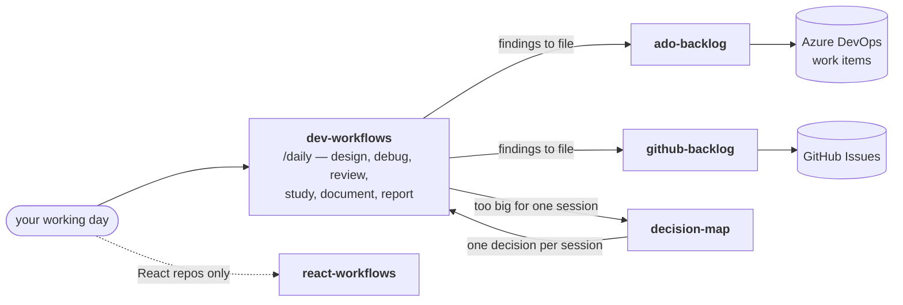

# workflow-daily-work

[](LICENSE)
[](https://code.claude.com)
[](plugins/dev-workflows/.antigravity/INSTALL.md)

A **Claude Code plugin marketplace** for the working day of a software engineer: design a
change, debug it, review it, study a system nobody documented, plan an effort too large
for one sitting, and file what you find as real tracker items. Each step is a named skill
you invoke on purpose — not a prompt you rewrite every morning.

Nothing reaches your tracker without a dry run and your explicit approval.



## The plugins

Each one installs on its own. Start with `dev-workflows`.

| Plugin | What it does | Start with | Requires |
|---|---|---|---|
| **dev-workflows** | The daily-work arc — design, debugging, review, system study, documents, communication. | `/dev-workflows:daily` | Python 3, the `superpowers` plugin |
| **ado-backlog** | Findings from any source — spreadsheet, audit doc, pasted list — become an **Azure DevOps** backlog, dry-run gated, with ticket links written back to the source. | `/ado-backlog:run <file>` | Azure CLI, .NET 10 SDK, Python 3 + `openpyxl` |
| **github-backlog** | The same pipeline against **GitHub Issues** — labels, a milestone, a tracking issue, write-back. | `/github-backlog:run <file>` | `gh` CLI, Python 3 + `openpyxl` |
| **decision-map** | Plan an effort too big for one agent session as a map of decision tickets, and resolve exactly one per session. Markdown in your repo, or GitHub Issues. | `/decision-map:chart` | Python 3 (`gh` for the GitHub backend) |
| **react-workflows** | Opt-in React/TSX structure conventions. Install it only on React repos so it stays quiet during backend work. | no command — it triggers on React/TSX work | nothing |

**[PLAYBOOK.md](PLAYBOOK.md) is the map of when to reach for what.** It is the page to
read second. The only command worth memorising is `/dev-workflows:daily` — typing
`/daily` finds it via autocomplete.

## Install

```text
# in Claude Code
/plugin marketplace add ThodsaphonSonthiphin/workflow-daily-work
/plugin install dev-workflows@workflow-daily-work
```

Then add whichever backlog or planning plugin you need:

```text
/plugin install ado-backlog@workflow-daily-work
/plugin install github-backlog@workflow-daily-work
/plugin install decision-map@workflow-daily-work
/plugin install react-workflows@workflow-daily-work    # React repos only
```

**Per-plugin setup**, once per machine:

| Plugin | Do this | Then verify |
|---|---|---|
| `dev-workflows` | Install the upstream `superpowers` plugin — several skills hand off to it, and a missing install fails quietly rather than loudly: `/plugin marketplace add anthropics/claude-plugins-official` then `/plugin install superpowers@claude-plugins-official`. | Ask for a plan and confirm the handoff lands. |
| `ado-backlog` | `pip install openpyxl`, `az login`, and set `AZDO_ORG` / `AZDO_PROJECT` to **bare names** (`Cartagena365`, `GlassHull`) — not URLs. An `AZDO_PAT` is the fallback if Entra tokens are unavailable. | `/ado-backlog:setup-check` |
| `github-backlog` | `pip install openpyxl`, `gh auth login`, and set `GH_OWNER` / `GH_REPO`. | `/github-backlog:setup-check` |

> CLI equivalents exist for every step: `claude plugin marketplace add …`,
> `claude plugin install …`. Add `--scope project` to install for a whole team (writes
> `.claude/settings.json`). Installing mid-session? `/reload-plugins` activates without a
> restart.

## A worked example

```text
/ado-backlog:run "C:\path\to\audit.xlsx"
```

The pipeline asks which columns hold what, which severities are in scope, and who to
assign to. It then shows a **dry run** — every work item it intends to create, validated
against your project's process — and stops. On your approval it creates the items and
writes each ticket link back into the source file.

Full toolkit, including its Safety gates section in full:
[`plugins/ado-backlog/README.md`](plugins/ado-backlog/README.md).
One-page cheat sheet: [`plugins/ado-backlog/QUICKSTART.md`](plugins/ado-backlog/QUICKSTART.md).

## Documentation

| Read | For |
|---|---|
| [PLAYBOOK.md](PLAYBOOK.md) | The daily arc — what to reach for, when. Start here. |
| [CONTEXT.md](CONTEXT.md) | The glossary. What "Organization", "Skill", "Decision map" mean here. |
| [docs/ARCHITECTURE.md](docs/ARCHITECTURE.md) | How the pipeline is built, and the recipe for adding a skill. |
| [docs/adr/](docs/adr/) | Accepted design decisions, with the trade-off each one made. |
| [CLAUDE.md](CLAUDE.md) / [AGENTS.md](AGENTS.md) | Conventions an agent or a new contributor must follow in this repo. |

Each plugin also carries its own `README.md`, and the backlog plugins carry a
`QUICKSTART.md`.

## Also runs on Antigravity

The `dev-workflows` skills run on **Google Antigravity** as well, from this same source
tree. Antigravity does not read the Claude Code marketplace, so install with the bundled
script — it stages the skills and rewrites the plugin-relative paths Claude expands for
itself. The source tree stays Claude-native, so the marketplace install above is
unaffected. Re-run it after every update.

Antigravity has no plugin registry — it discovers skills semantically, by `description` —
so confirm on your own machine that they trigger the way you expect. That part is not
verified here.

Steps, scopes and verification:
[`plugins/dev-workflows/.antigravity/INSTALL.md`](plugins/dev-workflows/.antigravity/INSTALL.md).

Keeping personal copies of these skills under `~/.claude/skills/`?
[`docs/personal-skills-mirror.md`](docs/personal-skills-mirror.md) covers the sync script.

## License and attribution

MIT — see [LICENSE](LICENSE).

`dev-workflows` vendors a small number of skills from other MIT-licensed projects, each
with its licence kept alongside the copies:

- [obra/superpowers](https://github.com/obra/superpowers) — six review and planning
  skills, **modified** so that review steps route to this plugin's own review engine.
  See [`plugins/dev-workflows/LICENSE-superpowers`](plugins/dev-workflows/LICENSE-superpowers).
- [mattpocock/skills](https://github.com/mattpocock/skills) — vendored verbatim.
  See [`plugins/dev-workflows/LICENSE-mattpocock-skills`](plugins/dev-workflows/LICENSE-mattpocock-skills).
