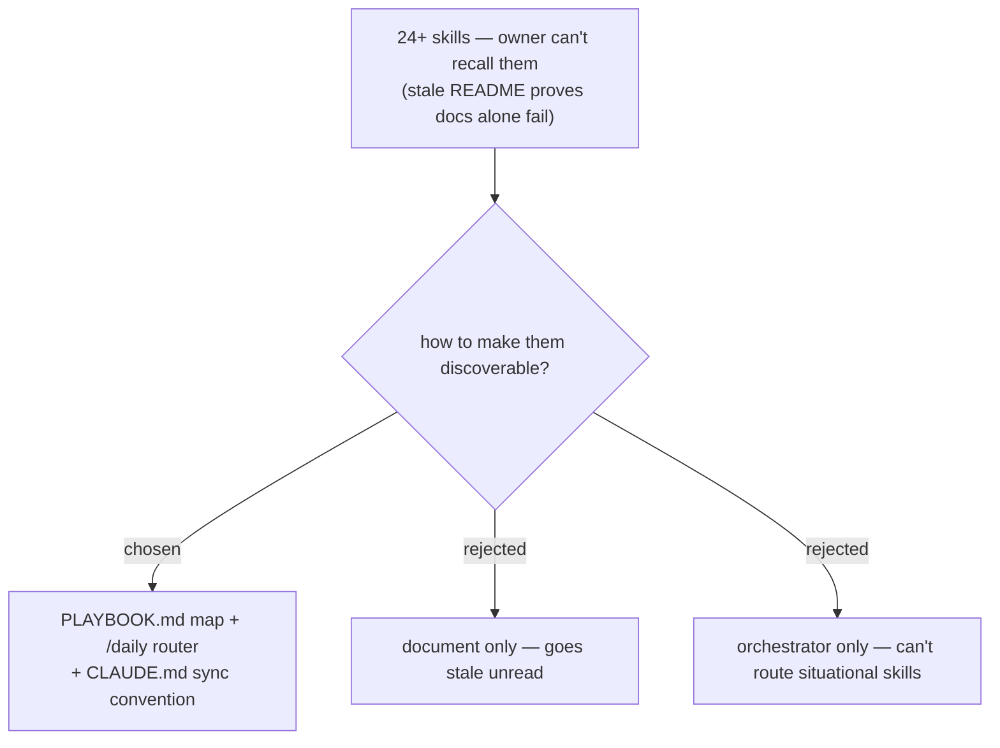

# ADR 0001 — Skill discoverability via PLAYBOOK.md + /daily router, kept current by convention

- **Status:** Accepted
- **Date:** 2026-06-11

## Context

The marketplace has grown to 3 plugins / 24 skills. The owner can no longer recall
what exists or when each skill should trigger, and asked whether the skills can be
orchestrated into a daily workflow. The root README is two plugins out of date,
proving that passive documentation alone goes stale here.

The skills split into two natures: a **routine arc** (morning my-work → filing
findings → status reporting → end-of-day invoice) that recurs every day in order,
and a **situational toolbox** (grill-then-plan, study-design-verify, naming-audit,
fit-gap-analysis, problem-description, ticket-trace, debug-style skills) that fires
on events, not on a schedule. A fixed-sequence orchestrator cannot cover the
situational skills; a document alone covers everything but requires remembering to
read it.

## Decision

Ship **both**, with a sync convention:

1. **`PLAYBOOK.md` at the repo root** — one page: the daily arc as a sequence, plus
   a "when X happens → reach for Y" trigger table for situational skills. The map
   for the human.
2. **A `/daily` command + skill in `dev-workflows`** — the single memorized entry
   point. It asks where the user is in their day and routes to the right skill.
   The router for the routine.
3. **A convention in `CLAUDE.md`**: every new skill must add one row to
   `PLAYBOOK.md` — enforced the same way as the plugin version-sync rule.

## Consequences

- ➕ One thing to memorize (`/daily`); everything else is reachable from it or the playbook.
- ➕ The playbook covers situational skills that no orchestrator can sequence.
- ➕ The CLAUDE.md convention makes staleness a review-time failure instead of a
  silent drift (the README staleness that motivated this decision).
- ➖ Two artifacts to keep aligned (playbook rows ↔ actual skills). Mitigated by the
  convention.
- ➖ `/daily` in dev-workflows references skills from other plugins (ado-backlog
  my-work); it must degrade gracefully when a referenced plugin is not installed.

## Alternatives considered

- **Document only** — rejected: the stale README shows passive docs aren't read or
  maintained without a forcing function, and the user still has to remember to look.
- **Orchestrator only** — rejected: situational skills (debugging, audits, design
  sessions) fire on events; a fixed daily sequence cannot route to them, so most of
  the 24 skills would stay undiscoverable.
