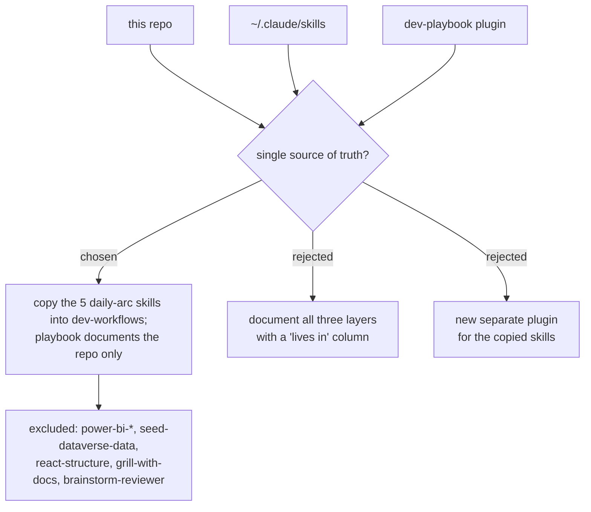

# ADR 0002 — Consolidate personal skills into the repo; repo is the single source of truth

- **Status:** Accepted
- **Date:** 2026-06-11

## Context

The owner's skill ecosystem spans three layers: this repo's plugins (24 skills),
personal `~/.claude/skills` (~15 skills, e.g. debug-mantra, post-mortem, scrutinize),
and a separate installed `dev-playbook` plugin (5 skills). Several skills exist in
two or three layers at once (grill-then-plan, management-talk, invoice-generator,
problem-description, dual-verifier, drive-to-legacy), and the copies can drift apart
silently. The PLAYBOOK.md / `/daily` work (ADR 0001) needs one authoritative skill
inventory to document.

Two scope options existed for the playbook: document the whole three-layer ecosystem
(with a "lives in" column), or consolidate first so the repo *is* the ecosystem.

## Decision

Copy the missing **daily-arc** skills into this repo (the `dev-workflows` plugin),
making the repo the **single source of truth** for daily-work skills. The playbook
then documents the repo only.

Exactly five skills are copied — the ones in the WORKING phase of the daily arc
that the repo lacks:

| Skill | Role in the arc |
|---|---|
| `debug-mantra` | something broke → debugging discipline |
| `post-mortem` | after the fix → canonical bug record |
| `scrutinize` | second opinion on a plan/PR/change |
| `dual-verifier` | independent verification of completed work |
| `drive-to-legacy` | exploring an unfamiliar legacy codebase |

**Explicitly excluded** (stay personal, outside this repo): the 13 `power-bi-*`
skills, `seed-dataverse-data`, `react-structure`, `grill-with-docs`,
`brainstorm-reviewer`. The repo's scope is the daily-work arc, not every tool
domain the owner touches.

Skills are version-controlled, shareable with colleagues via the marketplace, and
maintained in one place.

## Consequences

- ➕ One inventory to document, one place to maintain; PLAYBOOK.md rows map 1:1 to
  repo skills.
- ➕ Personal skills gain git history, review, and marketplace distribution.
- ➕ Duplication across layers becomes visible and resolvable instead of silent.
- ➖ The personal copies in `~/.claude/skills` and the `dev-playbook` plugin become
  redundant; until removed/uninstalled, duplicate skill names may shadow or confuse
  triggering. Follow-up: prune the personal copies after verifying the repo versions
  work via plugin install.
- ➖ Repo grows beyond pure "daily work pipelines" into a general personal toolkit —
  accepted; the repo is named `workflow-daily-work` and that is its purpose.

## Alternatives considered

- **Document all three layers with a "lives in" column** — rejected: documents the
  drift problem instead of fixing it; every future skill addition must decide which
  layer again.
- **New separate plugin for the copied skills** — rejected: `dev-workflows` already
  is the general-purpose workflow plugin; a fourth plugin adds an install step with
  no boundary benefit.
