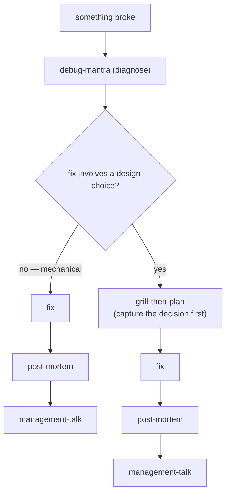

# ADR 0003 — Conditional debug chain: grill-then-plan only when the fix involves a design choice

- **Status:** Accepted
- **Date:** 2026-06-11



## Context

The daily arc's WORKING phase chains the debugging skills:
`debug-mantra → fix → post-mortem → management-talk`. The owner wanted
documentation to happen **before** code changes, proposing grill-then-plan between
diagnosis and fix.

Always grilling is too heavy: a one-character typo fix found in 10 minutes does not
justify a grilling session, design spec, and implementation plan. But a fix that
chooses between competing strategies (e.g. two locking approaches for a race
condition) deserves its decision captured before code changes — exactly what
grill-then-plan does (CONTEXT.md/ADR capture, spec, plan).

## Decision

The debug chain branches at one question after diagnosis: **does the fix involve a
design choice?**

```
something broke → debug-mantra (diagnose)
   ├─ fix is mechanical/obvious → fix → post-mortem → management-talk
   └─ fix involves a design choice → grill-then-plan (capture decision first)
                                      → fix → post-mortem → management-talk
```

Documentation happens on both branches: post-mortem records root cause, mechanism,
fix, and validation after the fact; grill-then-plan additionally captures the
*decision* beforehand, only when there is a real decision to capture.

This chain is encoded in PLAYBOOK.md and the `/daily` router's "something broke"
station.

## Consequences

- ➕ Trivial fixes stay fast; no ceremony tax on one-liners.
- ➕ Design-laden fixes get their trade-off documented before code changes, when
  alternatives are still live — not reverse-justified after.
- ➕ Every fixed bug still ends with a post-mortem, so nothing goes unrecorded.
- ➖ "Involves a design choice" is a judgment call; the router asks rather than
  detects. Mitigation: the branch question is explicit in the playbook, and a wrong
  "mechanical" call still gets caught by post-mortem review.

## Alternatives considered

- **Always grill-then-plan before any fix** — rejected: turns 10-minute fixes into
  hour-long sessions; the ceremony cost would push the owner to skip the chain
  entirely, losing documentation everywhere instead of gaining it.
- **Never grill before fixing (post-mortem only)** — rejected: decisions with real
  trade-offs would be documented only after the fact, as justification instead of
  deliberation.
