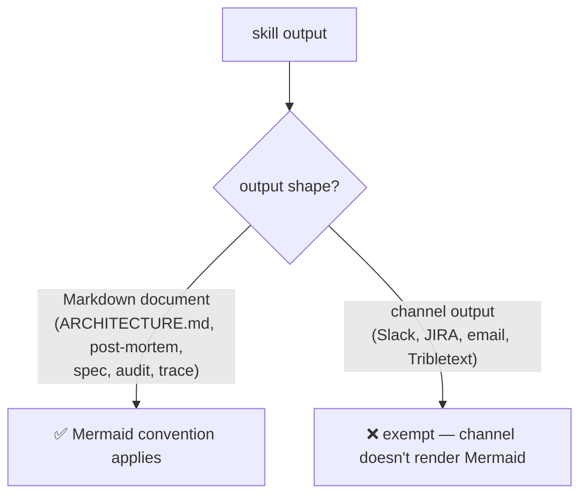

# ADR 0005 — Mermaid diagrams required in skill-generated Markdown documents; channel outputs exempt

- **Status:** Accepted
- **Date:** 2026-06-12

## Context

dev-workflows skills produce two kinds of output: durable Markdown documents
(ARCHITECTURE.md from crm-archaeology, drive-to-legacy studies, post-mortems,
grill-then-plan specs/ADRs, fit-gap analyses, naming audits, ticket traces) and
channel-shaped text (management-talk's Slack/JIRA/email/standup outputs,
invoice-generator's Tribletext summary). Two skills already mandate diagrams —
drive-to-legacy ("Mermaid diagrams everywhere") and crm-archaeology ("Mermaid
everywhere" in its architecture template) — but the rest of the document
producers have no diagram guidance, so generated documents are inconsistently
readable. The owner wants every generated document to carry diagrams that make
it easy to understand.

## Decision

The Mermaid-diagram convention applies to **every skill that generates a
Markdown document artifact** — consistent with what drive-to-legacy and
crm-archaeology already do. **Channel outputs are exempt**: Slack, JIRA
comments, email, and standup lines don't render Mermaid, so forcing diagrams
there fights the medium.

## Consequences

- ➕ One consistent convention; future document skills inherit a known rule.
- ➕ The two existing "Mermaid everywhere" skills become instances of a
  marketplace convention instead of local habits.
- ➖ Each affected SKILL.md needs an edit (post-mortem, grill-then-plan,
  study-design-verify, fit-gap-analysis, naming-audit, ticket-trace).
- Open at time of writing (resolved in follow-up ADRs): whether the rule
  attaches per-skill or per-destination (post-mortem can land as a JIRA
  comment), mandatory-vs-conditional, the diagram-type mapping, and where the
  canonical wording lives.

## Alternatives considered

- **Every output including channels** — rejected: Mermaid doesn't render in
  Slack/JIRA/email; the diagram would arrive as a wall of code-fenced text.
- **Only the study-skill family** — rejected: leaves post-mortems, specs, and
  audits as inconsistent walls of prose, which is exactly the complaint.
