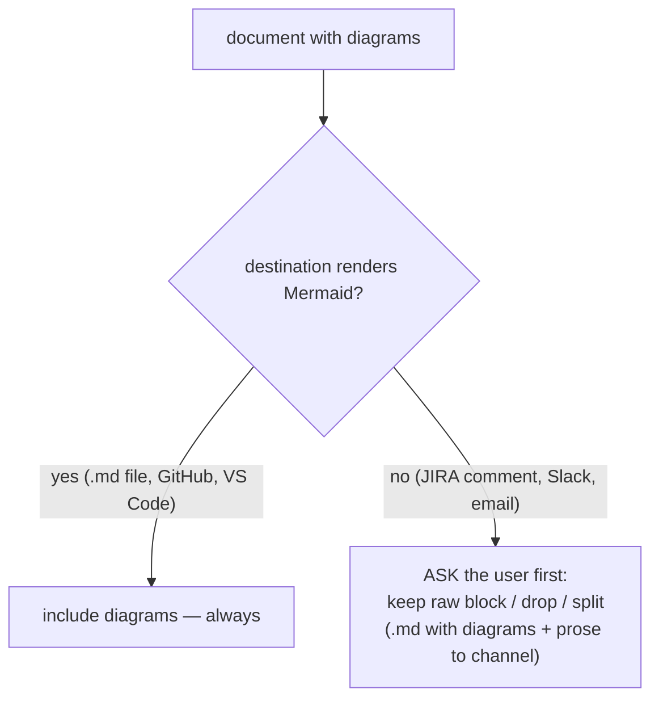

# ADR 0006 — Diagrams are always included; non-rendering destinations get an ask-gate

- **Status:** Accepted
- **Date:** 2026-06-12

## Context

ADR 0005 scopes the Mermaid convention to document skills but left open whether
the rule attaches per-skill or per-destination. The forcing edge: post-mortem's
default destination is a JIRA comment (no native Mermaid rendering), yet the
same content can land as `docs/postmortems/<ticket>.md` (renders fine). Two
candidate rules: per-destination (silently drop diagrams for channels) or
per-skill (always include, even as raw code fences).

## Decision

**Always include the diagrams.** When the chosen destination is known not to
render Mermaid (JIRA comment, Slack, email), the skill must **ask the user
first** instead of silently stripping or silently posting raw fences — e.g.
"this destination won't render Mermaid: keep the block anyway, drop it, or
write the full version with diagrams to a .md file and post the prose to the
channel?"

The user stays in control of the trade-off; the skill never decides alone.
Channel-only skills (management-talk, invoice-generator) remain out of scope
per ADR 0005 — this ask-gate is for document skills whose artifact can land in
a non-rendering destination.

## Consequences

- ➕ No document silently loses its diagrams; no channel silently gets a wall
  of fenced text.
- ➕ Consistent with the marketplace's existing safety-gate culture (stop and
  ask before the irreversible/lossy step).
- ➖ One extra question in the post-to-JIRA flow; acceptable since post-mortem
  already has a sign-off gate before posting.

## Alternatives considered

- **Per-destination silent strip** — rejected by the owner: dropping diagrams
  without asking loses information invisibly.
- **Per-skill always, no gate** — rejected: pasting raw Mermaid fences into
  Slack/JIRA without warning reads as broken output.
