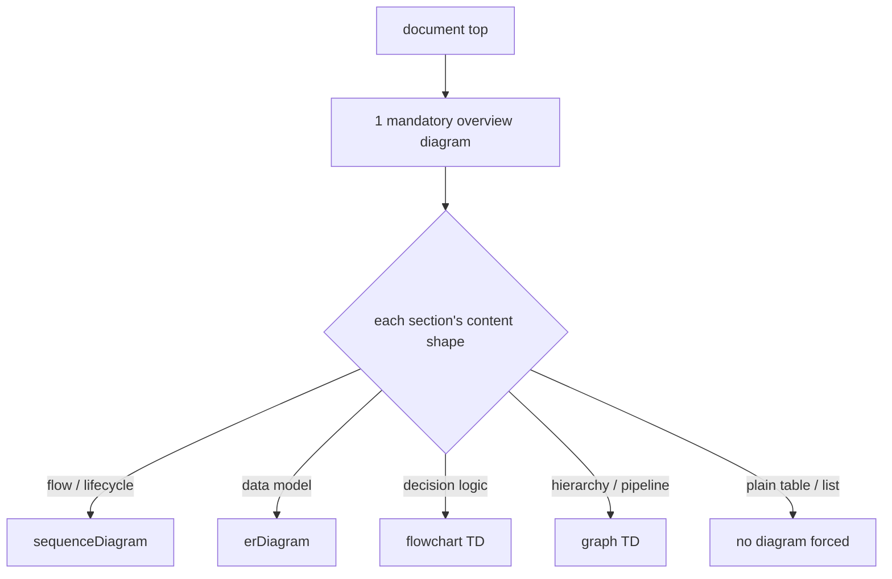

# ADR 0007 — Minimum bar: one overview diagram per document, type-matched diagrams per section

- **Status:** Accepted
- **Date:** 2026-06-12

## Context

ADR 0005/0006 say generated Markdown documents always carry Mermaid diagrams,
but "carry diagrams" needs a testable minimum. Candidates ranged from "only
where content fits" (a doc could have zero) to "every section gets one"
(forces decorative diagrams into tables and lists).

## Decision

Two-part minimum for every skill-generated Markdown document:

1. **One mandatory overview diagram at the top** — the shape of the whole
   thing before any prose (the same pattern PLAYBOOK.md uses).
2. **Type-matched section diagrams** wherever a section describes a flow, data
   model, decision, or hierarchy, using the mapping drive-to-legacy already
   established as the codified standard:

   | Content shape | Mermaid type |
   |---|---|
   | flow / lifecycle / interaction | `sequenceDiagram` |
   | data model / entity relationships | `erDiagram` |
   | decision logic / branching | `flowchart TD` |
   | hierarchy / pipeline / dependency | `graph TD` |

No forced diagrams where nothing fits — a pure table/list section stays prose.

## Consequences

- ➕ Testable: a reviewer can check "overview diagram present?" mechanically.
- ➕ The type mapping removes per-skill judgment calls and keeps diagrams
  consistent across documents.
- ➖ Short documents (a one-page audit) still owe one overview diagram, even
  when it's small.

## Alternatives considered

- **Only where content fits** — rejected: lets a document ship with zero
  diagrams, which is the current complaint.
- **Every section** — rejected: decorative diagrams in list/table sections add
  noise, not understanding.
