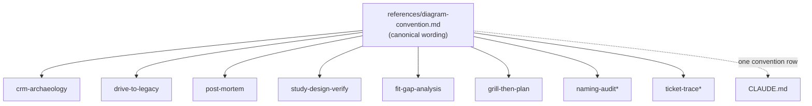

# ADR 0008 — Diagram convention lives in one shared reference file in dev-workflows

- **Status:** Accepted
- **Date:** 2026-06-12

## Context

The diagram convention (ADRs 0005–0007) must be visible to every document
skill at runtime. Installed plugins can't read the marketplace repo root, so
CLAUDE.md/PLAYBOOK.md alone can't carry it. Duplicating the rule into every
SKILL.md (8 copies) invites drift — the exact failure mode the ado-backlog
plugin solved for data contracts with a single `references/data-contracts.md`.

## Decision

Mirror the data-contracts pattern: the canonical wording lives in
**`plugins/dev-workflows/references/diagram-convention.md`** (full rule:
mandatory overview diagram, the content-shape → Mermaid-type mapping, the
ask-gate for non-rendering destinations). Each document skill's SKILL.md adds
a one-line pointer via `${CLAUDE_PLUGIN_ROOT}/references/diagram-convention.md`.
drive-to-legacy and crm-archaeology keep their existing diagram instructions
but align them to (and point at) the shared file. CLAUDE.md gains one row in
the conventions list so contributors know the rule exists.

## Consequences

- ➕ One place to evolve the convention; skills can't drift apart.
- ➕ Same mental model as data contracts — "canonical shapes live in one
  reference file" is already house style.
- ➖ First plugin-level `references/` directory in dev-workflows (until now
  only per-skill `references/` existed there); the layout docs need updating.

## Alternatives considered

- **Duplicate block per SKILL.md** — rejected: 8 copies, guaranteed drift.
- **Marketplace-root doc only** — rejected: invisible to installed plugins at
  runtime; the rule would exist only for repo contributors, not for the
  skills doing the generating.
