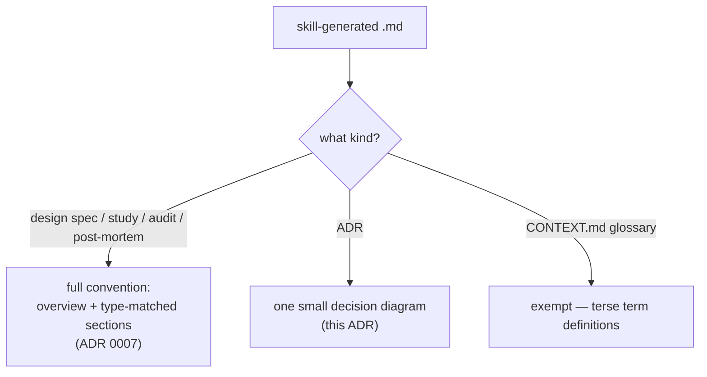

# ADR 0009 — ADRs carry a decision diagram too; the glossary is the only exemption

- **Status:** Accepted
- **Date:** 2026-06-12

## Context

ADR 0007 sets the minimum bar for generated documents, but grill-then-plan also
generates ADRs and CONTEXT.md — both deliberately terse formats. The
recommendation on the table was to exempt both. The owner chose more
uniformity instead.

## Decision

**ADRs are inside the convention**: every ADR opens with one small Mermaid
diagram of the decision (typically a `flowchart TD` of the chosen path vs the
rejected alternatives, or the structure the decision creates). **CONTEXT.md is
the single exemption** — a glossary is term definitions; a diagram is allowed
but never required there.

Existing ADRs (marketplace 0001–0008, plugin-level ones) are backfilled with
decision diagrams during implementation so the corpus is uniform.

## Consequences

- ➕ A reader can skim `docs/adr/` visually; the diagram is the decision's
  thumbnail.
- ➕ Simpler rule than "specs yes, ADRs no" — only one exemption to remember.
- ➖ One-paragraph ADRs grow a few lines of ceremony; accepted trade-off.

## Alternatives considered

- **Exempt ADRs and the glossary** (the recommendation) — rejected by the
  owner: uniformity across generated docs beats terseness.
- **No exemptions at all** — rejected: diagramming a glossary adds nothing; a
  term list has no structure worth drawing.
