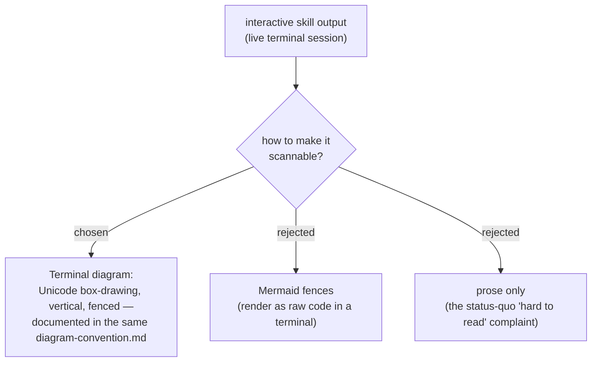

# ADR 0010 — Terminal ASCII diagrams for interactive skills (sibling to the Mermaid document convention)

- **Status:** Accepted
- **Date:** 2026-06-15

## Context

dev-workflows skills produce two kinds of output, and the existing diagram
convention (ADRs 0005–0009) only covers one of them. The Mermaid convention
governs **Markdown-document** output (ARCHITECTURE.md, post-mortems, specs,
audits) and explicitly **exempts** channel/chat output — and in any case Mermaid
fences render as a wall of raw code in a terminal, not as a diagram.

That leaves **interactive skills** — whose output is a live terminal session,
not a `.md` file — with no diagram guidance at all. `debug-mantra` is the
trigger: its four-step discipline (reproduce → fail-path → falsify →
breadcrumbs), including the step-2 escalation ladder and the loop-backs, is
delivered as prose, and the owner finds it hard to read in the terminal.

## Decision

Establish a **terminal-diagram** convention as the sibling of the Mermaid
document convention:

- **Render target decides the family.** Markdown document → Mermaid (existing);
  live terminal session → **terminal diagram** (new).
- **Style:** Unicode box-drawing, **vertical** layout (stays ≲ 50 cols, never
  wraps), emitted inside a fenced code block so it renders monospace.
- **It augments, never replaces** existing prose — same supplement-not-replace
  principle the Mermaid convention already uses.
- **Single source of truth.** The wording lives in the **same**
  `plugins/dev-workflows/references/diagram-convention.md`, reframed to lead with
  the render-target split, then the Mermaid rules, then the terminal-diagram
  rule — honoring ADR 0008 (one reference file for all diagram rules).
- **Scope cap:** `debug-mantra` is the **sole pilot adopter** in this effort
  (see plugin ADR 0001). No other interactive skill is retrofitted now.

## Consequences

- ➕ Interactive skills get a render-appropriate diagram instead of unreadable
  Mermaid or a wall of prose.
- ➕ All diagram rules stay in one reference file; the Mermaid/terminal split is
  written down once and not relitigated.
- ➕ Future interactive skills inherit a known pattern when they want one.
- ➖ `diagram-convention.md` now covers two families and must be retitled/reframed
  (it currently says "skill-generated Markdown documents").
- ➖ The synced personal-skills copy at `~/.claude/skills/diagram-convention.md`
  must be re-synced after the canonical file changes.
- ➖ ASCII alignment is hand-maintained — no renderer catches drift.

## Alternatives considered

- **Mermaid in the terminal** — rejected: renders as raw code-fenced text, the
  opposite of readable.
- **A separate new reference file for terminal diagrams** — rejected: violates
  ADR 0008's single-reference-file principle; two files invite drift.
- **Retrofit all interactive skills now** (scrutinize, study-design-verify, …) —
  rejected: scope creep into skills we haven't examined; pilot one first.
- **Leave debug-mantra as prose** — rejected: that prose is exactly the
  "hard to read" complaint that started this.
