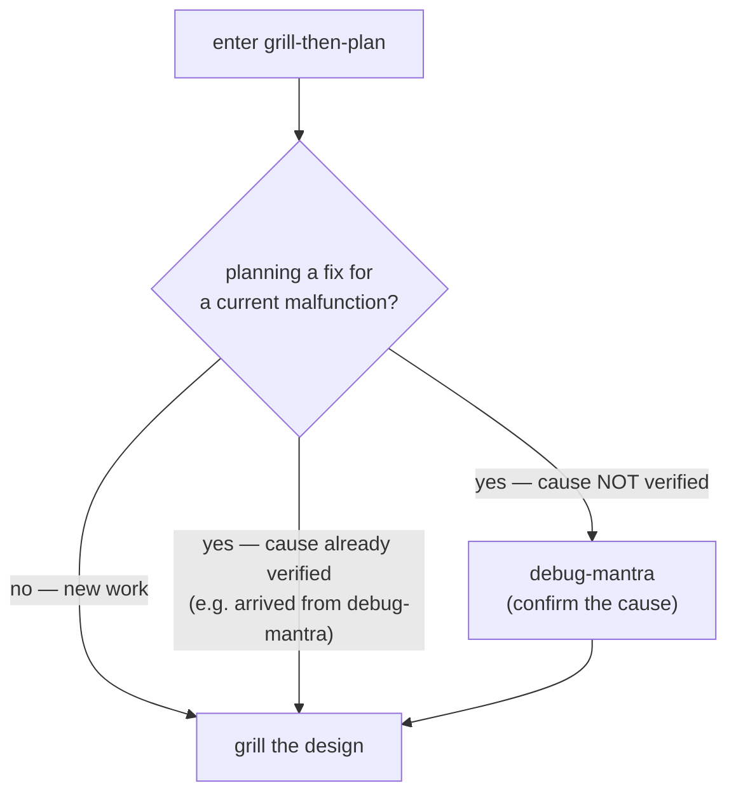

# ADR 0011 — grill-then-plan verifies the cause first when planning a fix

- **Status:** Accepted
- **Date:** 2026-06-17

## Context

ADR [0003](0003-conditional-debug-chain.md) chains the debug skills in the
*forward* direction: `something broke → debug-mantra → grill-then-plan (when the
fix involves a design choice)`. That covers the entry point where you already
know you are debugging.

But grill-then-plan has another entry point. Via `/daily work → designing
something`, or a direct `/grill-then-plan`, the user can land in a grilling
session whose actual purpose is to design a *fix* for something that misbehaves —
without ever having diagnosed it. Grilling a fix design against an unverified
guess about *why* it breaks documents a decision built on sand: the spec, the
ADR, and the plan all inherit the wrong premise.

The owner observed this gap — "shouldn't grill-then-plan find the truth first?" —
which is the mirror image of ADR 0003's question, asked from the other side.

## Decision

grill-then-plan adds an entry guard (Step 1a): **if the plan exists to fix a
current malfunction whose root cause is not yet verified, hand off to
debug-mantra first**, then return and grill the fix design against the confirmed
cause.

The guard is skipped — proceed straight to grilling — when either:

- the work is new (feature, refactor, redesign) with no malfunction behind it; or
- the cause is already verified, in particular when the session arrived *from*
  debug-mantra via the ADR 0003 forward chain. **Do not re-diagnose** — the two
  ADRs meet here rather than looping.

Together, ADR 0003 and this ADR guard both entry points with one principle:
**never plan a fix on an unverified cause.**

## Consequences

- ➕ Fix designs are grilled against a confirmed root cause, not a hypothesis —
  no reverse-justified specs.
- ➕ Symmetric with ADR 0003: whichever skill you enter first, the verified-cause
  invariant holds.
- ➕ New-work planning is untouched — no debugging ceremony on greenfield design.
- ➖ "Is the cause verified?" is a judgment call. Mitigation: the guard explicitly
  exempts the from-debug-mantra path, so the common chained case never double-asks.

## Alternatives considered

- **Unconditionally invoke debug-mantra at the start of every grill-then-plan** —
  rejected: most grilling sessions are new-feature or refactor design with no bug
  to reproduce; debug-mantra's first step (reproduce) would immediately hit its
  own "no repro → STOP", adding noise to every design session.
- **Leave it to the operator to pick debug-mantra first** — rejected: the whole
  point of the daily arc is that the skill encodes the discipline so it is not
  skipped under pressure; an undocumented norm is invisible.
