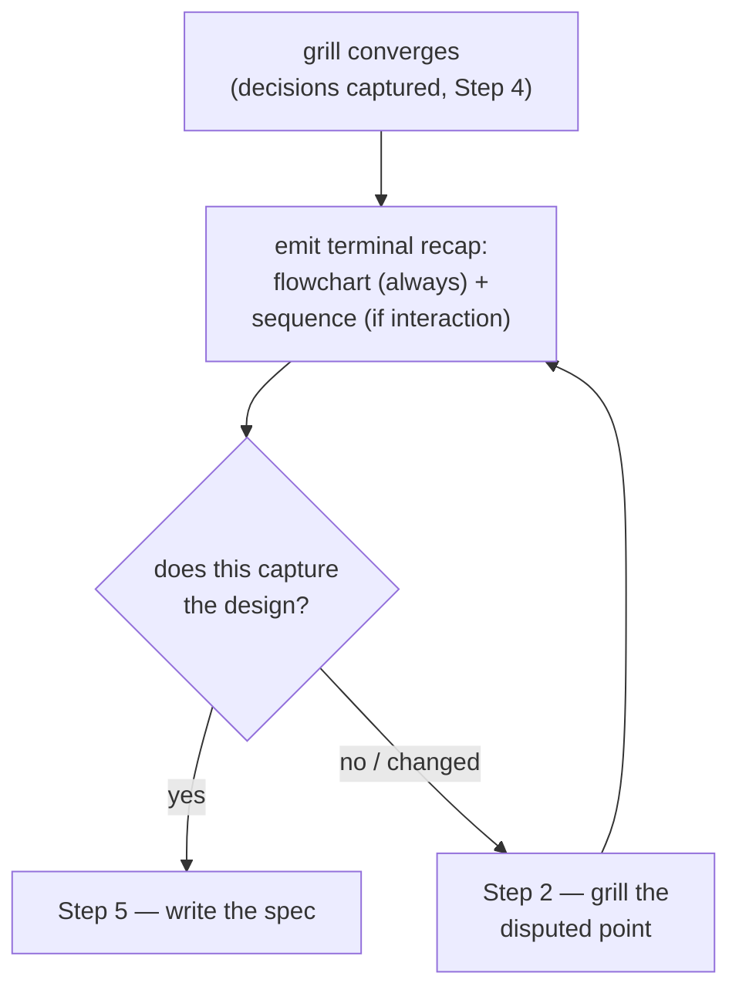

# ADR 0012 — grill-then-plan ends the grill with a Recap & confirm gate

- **Status:** Accepted
- **Date:** 2026-06-18

## Context

grill-then-plan grills the user down a design tree (Step 2), captures terms and
ADRs inline as decisions crystallize (Step 4), then writes the design spec (Step
5). Step 5 already gates on the user approving the *written spec* — but by then the
whole spec has been authored, so a misremembered or half-resolved decision surfaces
at the most expensive point.

The owner asked for the convergence point to carry a diagram — "grill-then-plan
should have UML to show when summary" — preferring a flowchart, with a sequence
diagram where it fits. Because the grilling runs in a **live terminal**, where
Mermaid renders as raw code, the recap uses the terminal-diagram family of ADR
[0010](0010-terminal-diagrams-for-interactive-skills.md) rather than Mermaid. This
is the second behavior refinement to this skill after ADR
[0011](0011-grill-then-plan-verifies-cause-first.md).

## Decision

grill-then-plan adds an internal **Step 4.5 — Recap & confirm** between capture
(Step 4) and spec-writing (Step 5): when grilling converges, emit a Unicode terminal
recap — **a flowchart of the grilled decisions (mandatory)** plus **a sequence of
the runtime interaction (optional, only when ≥ 2 actors exchange messages)** — and
ask the user to confirm it captures the design. On confirmation, proceed to Step 5;
on a correction, return to Step 2 and re-recap until confirmed.

The terminal-diagram convention gains one line authorising this: a skill MAY mandate
a recap for itself and type-match it the way Rule 2 does (flowchart of decisions
mandatory, sequence of interaction optional). No Rule 2 palette change — both types
already exist there.

## Consequences

- ➕ A cheap pre-spec checkpoint catches a divergent decision set before the full
  spec is written, not after.
- ➕ The convergence point carries a diagram in the type the design's shape calls
  for, consistent with the spec's own Rule 2 type-matching.
- ➕ Complements rather than duplicates Step 5: Step 4.5 confirms the *decision set*;
  Step 5 confirms the *written spec*.
- ➖ "Does the design have a real interaction?" is a judgment call. Mitigation: the
  flowchart is always shown; the sequence is explicitly optional, so a wrong call
  only omits a supplementary diagram, never the mandatory one.
- ➖ One extra confirmation turn per session. Mitigation: it loops back into grilling
  only on a correction — which would otherwise have surfaced as costlier spec rework.

## Alternatives considered

- **Mermaid in the live recap** — rejected: Mermaid renders as raw code in a
  terminal; the terminal-diagram family (ADR 0010) exists for exactly this.
- **A state diagram as the mandatory diagram** — rejected: a state diagram fits only
  a lifecycle/status subject; most grilled designs are not state machines, so it
  would force an ill-fitting diagram and require a new palette type.
- **Always emit both a flowchart and a sequence** — rejected: a pure data-model or
  config design has no real interaction, so a forced one-actor sequence is noise;
  "no forced diagrams" stays intact.
- **Read-only recap with no gate** — rejected: the value is the confirmation; a recap
  the user cannot correct before Step 5 is decoration.
- **Rely on Step 5's existing spec-approval gate alone** — rejected: that gate fires
  after the spec is written, catching divergence at the most expensive point.
- **Record this in a plugin-level ADR instead of root** — rejected: the change amends
  the root terminal-diagram convention (ADR 0010), which spans interactive skills, so
  it belongs at root alongside 0005–0011.
