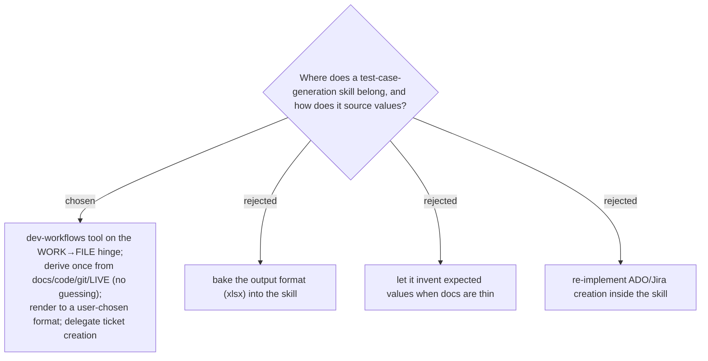

# Generating-test-cases sits on the WORK→FILE hinge, evidence-grounded, delegates ticket creation

`generating-test-cases` lives in `plugins/dev-workflows/skills/` and sits on the
**WORK → FILE hinge**: it runs after a feature is built (`grill-then-plan` → build)
or a bug is fixed (`post-mortem` → regression case), and its failed/`TBD` cases
flow out to `findings-to-ado-backlog` / `ado-create-work-items` (FILE), with the
summary to `management-talk` (REPORT).

Three decisions, each the result of a measured RED baseline (a no-skill agent
generating test cases for the SPRecorder screen-recording feature):

- **Evidence-grounded, no guessing (Iron Law).** Every case/expected/datum must
  cite a real source (doc, code `file:line`, git, or the LIVE system); unsourced
  values are marked `TBD (needs confirmation)` and asked, never invented. The
  baseline read code+git well but **never queried the live system** and put
  evidence in an after-the-fact report rather than a required per-row field — so
  the skill makes a live-system step explicit and an `Evidence` column mandatory
  (the xlsx adapter red-flags any row missing it or containing a guess-word).
  This is the same "live system / authoritative source wins" stance as
  `naming-audit` and `study-design-verify`.
- **Format is a late, swappable step.** Coverage is derived once into a
  format-blind canonical model; the skill **asks the user** the destination
  (xlsx / Markdown / CSV / tracker) before rendering. The baseline silently
  assumed a format. Separating model from adapter lets the same suite re-render
  to a second format for free.
- **Delegate ticket creation.** The "tracker" output adapter hands off to the
  ado-backlog / github-backlog plugins rather than re-implementing work-item
  creation — those own the dry-run, safety gate, and write-back.

Built per `superpowers:writing-skills` (RED baseline → GREEN skill → verify a
fresh agent now asks the format, queries the live system, and fills per-row
Evidence). Per ADR 0001, the skill adds one row to PLAYBOOK in the same change.
