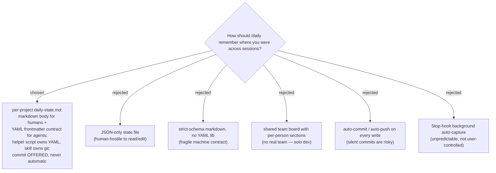

# ADR 0014 — /daily gains a cross-session work-state file (daily-state.md)

- **Status:** Accepted
- **Date:** 2026-06-19

## Context

ADR 0004 ships `/daily` as a **stateless** hybrid router: it asks at most two questions
and hands off to a station skill. That is correct within a session, but when the user
leaves and returns in a fresh session, `/daily start` shows the ADO board — which has no
idea the user was *mid-debug on #6125, cause confirmed, next step `grill-then-plan`*. The
resuming session (often another agent) has to reconstruct context from scratch.

The daily arc needs a small, durable **resume pointer** per project: where the user is in
the circle, the single active focus, and — most importantly — the explicit next step
captured while context was fresh. It must serve a **human** (who reads and edits prose)
*and* a **machine** (which parses a typed contract to resume or hand off), in keeping with
this repo's data-contract-first philosophy.

## Decision

Add one per-project file, `daily-state.md`, at the git repository root:

- **Markdown + YAML frontmatter, two readers.** The body is free-form human prose; the
  frontmatter is a documented data contract (`type`, `schema_version`, `updated`,
  `station`, `status`, `focus`, `next`, optional `chain`/`blockers`). The canonical
  schema lives in `plugins/dev-workflows/references/daily-state-contract.md`.
- **The router stops being purely stateless.** `/daily` and `/daily start` *read* the file
  and print a one-line welcome-back (skipping silently when absent); a new `/daily save`
  accelerator (synonyms `pause`/`checkpoint`, not a numbered station) and `/daily wrap`
  *write* it. The 5-station circle of ADR 0004 stays intact — `save` is surfaced only as a
  menu footer line.
- **Per-project runtime discovery.** Location is resolved at runtime via
  `git rev-parse --show-toplevel`, override order `--path` > `DAILY_STATE_FILE` env >
  git-root. Outside a repo, the skill asks rather than failing. Root-level (not a dotfolder)
  so humans see it and Obsidian indexes it.
- **Helper script owns YAML; skill owns git.** `scripts/daily-state.py` (PyYAML) is the only
  thing that touches the frontmatter — importable as functions and runnable as a CLI
  (`show` / `set` / `resolve-path`). `set` is read-modify-write and stamps `updated`. Git
  never runs inside the script.
- **Assisted, never automatic commit.** After any write the skill *offers* to commit and
  push (`y/n`), staging only `daily-state.md`. It never commits on its own.
- **Separate from auto-memory.** `daily-state.md` is the in-repo, version-controllable
  "resume HERE" pointer for the current project; auto-memory (`.claude/.../memory/`) keeps
  its broader, harness-private role. Different scope and storage, so they do not compete.
- **Replay, don't re-derive.** The skill replays the captured `next.action`; it does not
  infer the next step from the conversation — the correct pattern for hand-off.

## Consequences

- ➕ Returning to `/daily` narrates "welcome back, here's where you were, here's what to do
  next" — including across a different agent/session — instead of a cold board.
- ➕ The frontmatter is a typed, single-source-of-truth contract any agent or script can
  parse, not just this skill.
- ➕ Per-project, runtime-discovered file means every repo gets its own resume-point at a
  stable path with zero configuration.
- ➖ The router is no longer purely stateless; a new dependency (PyYAML) joins the
  prerequisites and `setup_check.ps1`.
- ➖ Two state stores now coexist (daily-state.md and auto-memory); the boundary must be
  documented (it is, in the contract reference) to avoid confusion about which holds what.
- ➖ The skill must keep `save`/`pause`/`checkpoint` out of the numbered 5-station menu, or
  it dilutes the ADR 0004 circle.

## Alternatives considered

- **JSON-only state file** — rejected: machine-clean but human-hostile to read or edit by
  hand; the file's whole point is that a person can open it and understand where they were.
- **Strict-schema markdown without a YAML library** — rejected: parsing structure out of
  prose with regexes is a fragile machine contract that breaks on the first freehand edit.
  PyYAML + a documented frontmatter contract is robust.
- **Shared team board with per-person sections** — rejected: there is no real team (solo
  dev); identity resolution and a shared standup board are apparatus with no consumer.
  Revisitable as a follow-up if a team materializes.
- **Auto-commit / auto-push on every write** — rejected: a router silently committing is
  risky (this workspace has two sub-repos and a non-repo root, and the project rule forbids
  root-level commits). For a same-machine resume the file is already on disk; commit is
  offered only when the next reader is elsewhere.
- **Stop-hook background auto-capture** — rejected: a background hook writing the file is
  unpredictable and not user-controlled. Writes happen only on explicit `/daily save` and
  `/daily wrap`.
