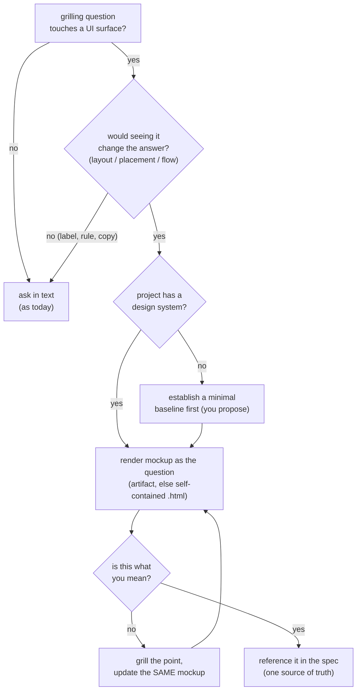

# ADR 0015 — grill-then-plan mocks the UI in-loop when seeing would change the answer

- **Status:** Accepted
- **Date:** 2026-06-26

## Context

grill-then-plan grills the user down a design tree in text (Step 2), captures terms
and ADRs inline (Step 4), recaps the decision set (Step 4.5), then writes and gates
the spec (Step 5). For a **UI surface**, text is the wrong instrument: the user and
the AI repeatedly believe they understand each other and picture different screens —
false agreement — because neither saw it. The divergence then surfaces only after
the feature is built, the most expensive possible point.

The owner asked for a mockup step and grilled its shape: it must run *during*
grilling (not as a post-hoc rubber stamp), the mockup-confirm must itself be one of
the one-at-a-time grilling questions, it must use the project's own design language
so it looks like the real app, and — because re-rendering is far cheaper than a
mis-built feature — render cost must not be the thing that limits it. The open
tension was render-spam: re-rendering the same screen for a copy tweak is waste, but
*not* rendering enough is the costlier failure. The owner also rejected a silent
"neutral wireframe" fallback when no design system exists: that produces
inconsistent mockups and an inconsistent build.

This is the third behavior refinement to this skill, after ADR
[0011](0011-grill-then-plan-verifies-cause-first.md) (verify the cause first) and ADR
[0012](0012-grill-then-plan-recap-gate.md) (recap-and-confirm gate).

## Decision

grill-then-plan gains **Step 3.5 — Mock the UI when seeing would change the answer**.
When a grilling question touches a UI surface and *seeing* would change the answer
(layout, where an element sits, what's on screen, the flow between states), the
mockup **is** the question: render it from the UI decisions resolved so far, in the
project's design language, and ask the user to confirm or correct — then loop on the
same artifact until confirmed.

- **Render gate** = "does seeing it change the answer?" — not a fixed checkpoint and
  not "render after every answer." Text-resolvable points (a label's words, a
  validation rule, a copy tweak) stay in text. Updates go to the **same** artifact/
  file; never spawn a new one per edit.
- **No design system → establish one first.** Do not wireframe ad-hoc. Surface it as
  a decision; following grilling's "always propose a recommended answer" habit, the
  skill offers a *minimal* baseline starter (palette, type scale, spacing, a few base
  components) the user approves or edits, persisted as a project file and captured as
  an ADR. Only then render.
- **Harness-neutral output.** A harness that renders artifacts (Claude Code) creates
  one; otherwise the skill writes a single self-contained `.html` to the working dir.
- **One source of truth.** The confirmed mockup's URL / `.html` path is referenced in
  the Step 4.5 recap and the Step 5 spec, so writing-plans and the implementer work
  from the same screen.

The full mechanism lives in a single new reference,
`plugins/dev-workflows/references/ui-mockup.md`; Step 3.5 points there and nothing
else restates it (same single-reference pattern as the diagram convention, ADR
[0008](0008-diagram-convention-single-reference-file.md)).

## Consequences

- ➕ Catches false UI agreement at grilling time, while the decision is cheap to
  change, instead of after the build.
- ➕ The mockup is a *seen* recommended answer — consistent with Step 2's habit of
  always proposing one, and with the Step 4.5 recap's "confirm before you commit".
- ➕ Harness-neutral: artifact where supported, self-contained `.html` fallback —
  works on Claude Code and Antigravity alike.
- ➕ The no-design-system gap is surfaced and fixed with a minimal baseline rather
  than silently wireframed, so mockups and the eventual build stay consistent.
- ➖ Rendering in the loop costs tokens/time. Mitigation: gated to "seeing changes
  the answer," updates reuse the same artifact, and the false-agreement rework it
  prevents is far costlier.
- ➖ "Is this question UI-shaped?" and "does the project have a design system?" are
  judgment calls. Mitigation: non-UI sessions never reach Step 3.5; when unsure, a
  quick render is cheaper than a wrong build.
- ➖ Establishing a baseline adds a sub-decision mid-grill. Mitigation: the skill
  proposes a minimal starter, so it is an approve/edit, not blocking homework.

## Alternatives considered

- **Mock only after grilling converges (post-hoc)** — rejected: a post-hoc mockup
  rubber-stamps at the end, after false agreement has already shaped every decision.
  The value is showing *during* grilling, while the decision is still live.
- **Always a low-fi neutral wireframe; no design system needed** — rejected: ad-hoc
  styling per mockup drifts, and without a shared baseline the mockups and the build
  are not consistent (the owner's point).
- **Make mockups mandatory for every grilling session** — rejected: most
  grill-then-plan work is backend / data-model / CLI with no UI surface, where a
  forced mockup is noise. Gated to UI questions only.
- **Mandate the Claude Code Artifact tool** — rejected: violates harness-neutrality
  (CLAUDE.md); Antigravity has no artifact tool. A self-contained `.html` fallback
  works everywhere.
- **Minimize renders to save cost** — rejected as the governing principle: the
  dominant cost is rework from false agreement, not a re-render. Render cost is
  managed by the "seeing changes the answer" gate and same-artifact updates, not by
  rendering less.
- **Inline the mechanism in SKILL.md** — rejected: a shared
  `references/ui-mockup.md` lets grill-with-docs reuse it and matches the repo's
  single-reference pattern.
- **Record this in a plugin-level ADR instead of root** — rejected: grill-then-plan's
  sibling behavior refinements (0011, 0012) live at the repo root; this one joins
  them.
