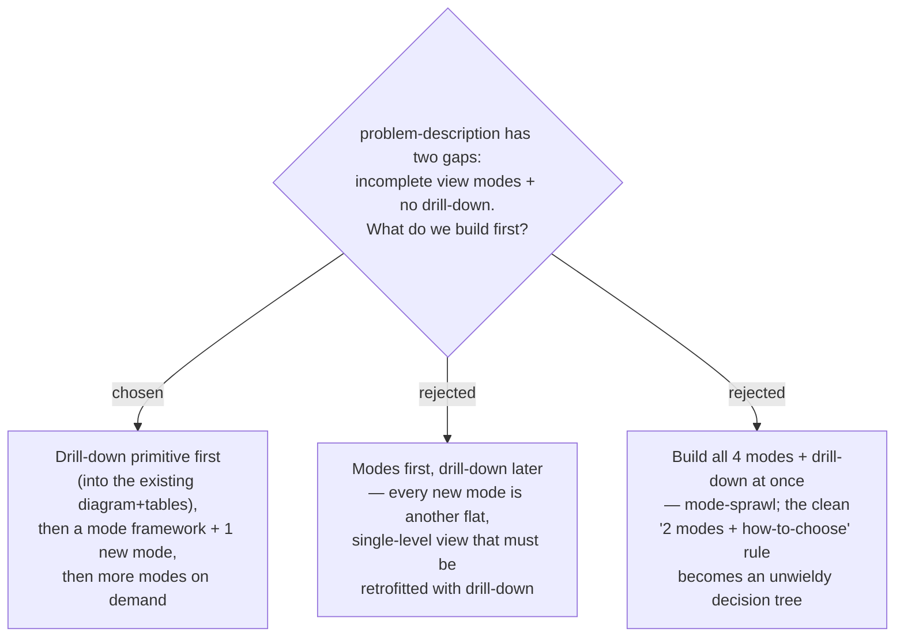

# problem-description evolves drill-down first, modes incrementally

The `problem-description` skill currently ships two visualization modes (diagram /
flow, tables / row-state). Grilling surfaced two distinct gaps: (1) some problems fit
neither mode (timeline, tree/hierarchy, state-machine, before/after), and (2) a reader
who hits an unfamiliar term in the narration (e.g. "glasshull scope") is stuck — the
walkthrough is flat and single-level, with no way to drill down for a definition or a
deeper sub-explanation. We build the **drill-down primitive first** because it is
*cross-cutting* (it improves the two existing modes immediately and every future mode
inherits it for free) and *foundational* (building modes first would create more flat
views that all need a later drill-down retrofit). Modes follow via a plug-in framework,
one at a time on real demand, rather than all at once — preserving the skill's clean
"pick the right mode" rule and avoiding mode-sprawl.
