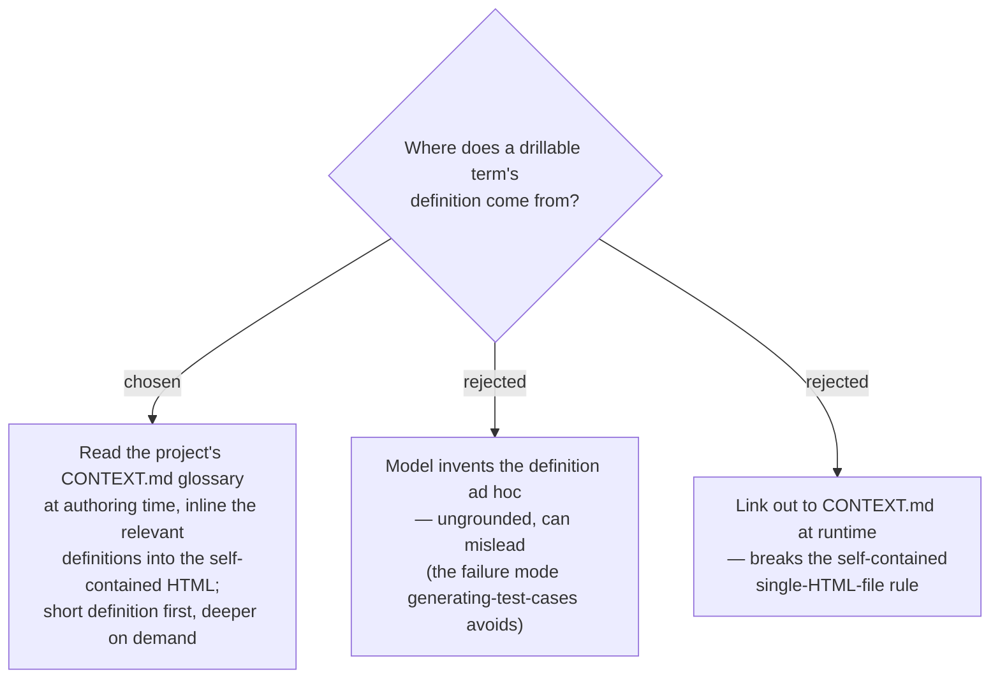

# Drill-down content is grounded in CONTEXT.md, inlined at authoring time

A reader who hits an unfamiliar term mid-walkthrough (e.g. "glasshull scope") needs a
grounded definition, not one the model guessed. So drill-down content is sourced from
the project's **CONTEXT.md glossary**: at generation time the skill reads CONTEXT.md and
**inlines** the relevant term definitions into the HTML (as data baked into the file),
preserving the self-contained-single-file rule. The reader sees a **short definition
first**; deeper material and related terms follow on demand. When a term is **not** in
CONTEXT.md, the author supplies a brief inline explanation as fallback (and may offer to
add it to CONTEXT.md, closing the loop with the grill-then-plan glossary discipline).
This makes problem-description walkthroughs *glossary-aware* — a consumer of the same
canonical vocabulary that grill-with-docs and grill-then-plan produce.
