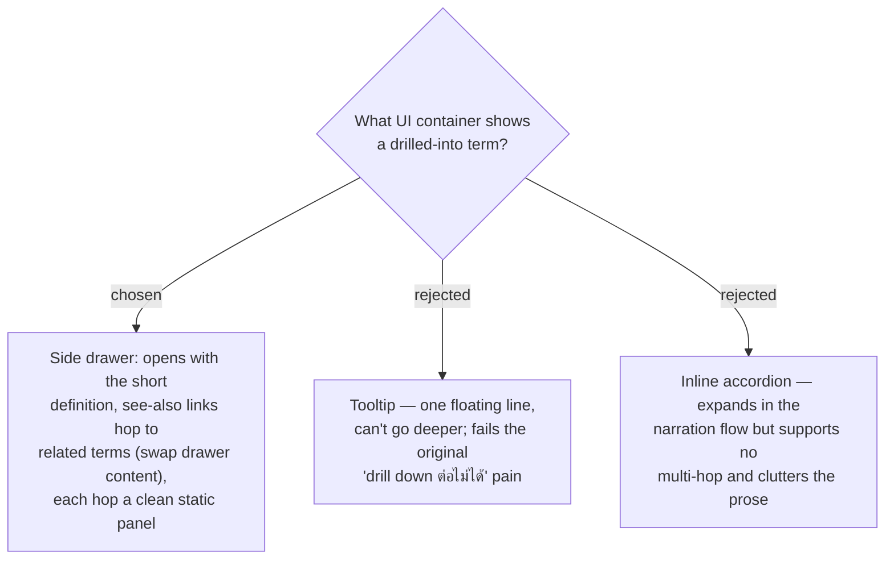

# Drill-down is a side drawer with see-also hops, not a tooltip

The reader's original pain was *not being able to drill down further* on an unfamiliar
term, while also wanting a short answer first. A **side drawer** satisfies both: it
opens showing the short (CONTEXT.md-sourced, per ADR 0017) definition, then offers
**see-also** links that swap the drawer to a related term — multi-hop depth without the
authoring weight and idempotent-scene complexity of a nested sub-walkthrough. A tooltip
was rejected because it cannot go deeper (the core requirement); an inline accordion was
rejected because it supports no hop and clutters the narration. The drawer is a
**transient overlay independent of step/scene state** — opening or closing it never
mutates the walkthrough's scene state, and navigating steps (Next / Prev / Reset) closes
it — so the skill's idempotent-scene rule stays intact. It also reuses the existing
template's declared-upfront, toggle-visibility panel pattern.
