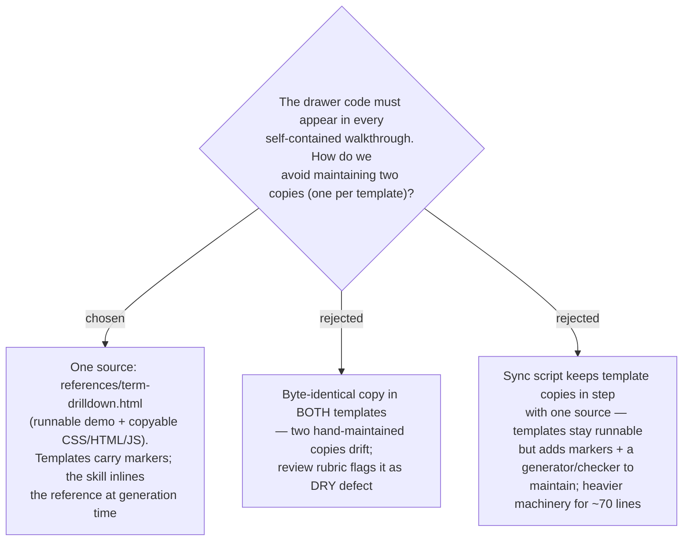

# Drill-down primitive lives in one reference file, inlined at generation

A generated walkthrough must be a **single self-contained file** (ADR 0017 / SKILL.md
output contract), so the drawer's CSS + HTML + JS physically appears in every output —
"DRY" cannot mean a runtime import. It can only mean **one source of truth at authoring
time**. We keep the primitive in a single new file,
`plugins/dev-workflows/skills/problem-description/references/term-drilldown.html`, which
is **both** the canonical copy (clearly-delimited CSS / HTML / JS-framework sections to
inline) **and** a standalone runnable demo of the drawer (open it in a browser to see it
work). The two templates no longer carry the drawer code — they carry a short marker at
each insertion point — and the skill inlines the reference sections into the walkthrough
it generates. This refines the *implementation* of [ADR 0018](0018-drill-down-is-side-drawer-with-see-also-hops.md)
(the drawer-vs-tooltip container choice is unchanged); it supersedes the earlier
"add the block to both templates" approach in the design spec. Trade-off accepted: the
raw templates no longer demo the drawer standalone — that demo now lives in the reference
file, which doubles as the single source. End-to-end integration is proven during
verification by assembling a sample walkthrough from a template + the reference.
