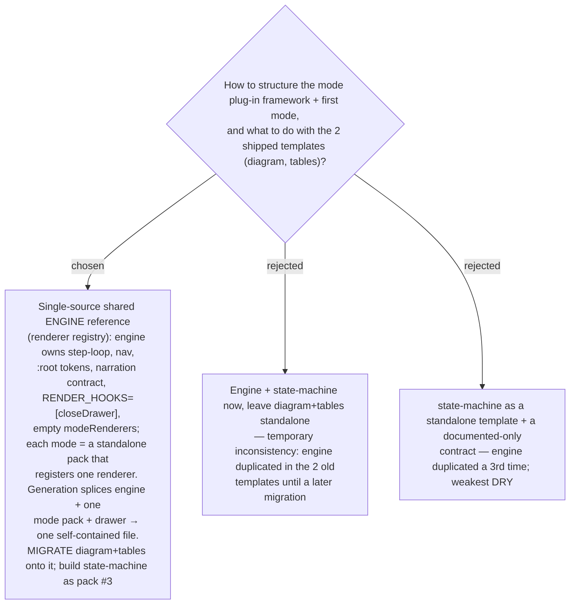

# Phase 2 mode framework: a renderer-registry shared engine, with both existing modes migrated onto it

Phase 2 (ADR 0016) needs a mode plug-in framework plus the first new mode. A design-space
workflow generated three framework shapes, scored them on a judge panel, and
adversarially broke the leader (it survived with fixes). The winner is a **renderer
registry on a single-source engine**: one `references/walkthrough-engine.html` (same DRY
single-source, inline-at-generation pattern as `references/term-drilldown.html`, ADR 0019)
owns the step loop, navigation, the `:root` palette tokens, the one canonical narration
contract, an ordered `RENDER_HOOKS = [closeDrawer]` array run first on every `render()`,
and an empty `const modeRenderers = {}`. Each mode is a standalone-runnable
`references/mode-<name>.html` pack that registers exactly one renderer object (its
id-registry, replace-only setters, and `clear()` body). Generation assembles **engine § +
the one chosen mode pack § + drawer § + authored scenes/GLOSSARY** into a single
self-contained file (only the chosen renderer inlined). The user chose the **full**
scope: the two existing modes (diagram, tables) are **migrated onto the engine** too —
not left standalone — so there is exactly one engine copy and full consistency, at the
cost of refactoring two just-shipped templates (tables' narration DOM + a background
token shift become visible changes). The first new mode is **state-machine** (validated
by domain evidence: ~15 `statecode/statuscode` pairs in the codebase, real lifecycles,
illegal-transition guards literally coded). The framework's one axis genuinely worse than
today — assembly-by-agent with no build step splicing three sources in a load-bearing
order — is mitigated by a **mandatory machine-checkable post-assembly self-test**
(registry-completeness + assembly-integrity asserts) the skill must run before reporting
done. Finer decisions (narration shape, token reconciliation, SVG color discipline,
additivity-proof depth, renderer ergonomics) are captured in their own ADRs as resolved.
