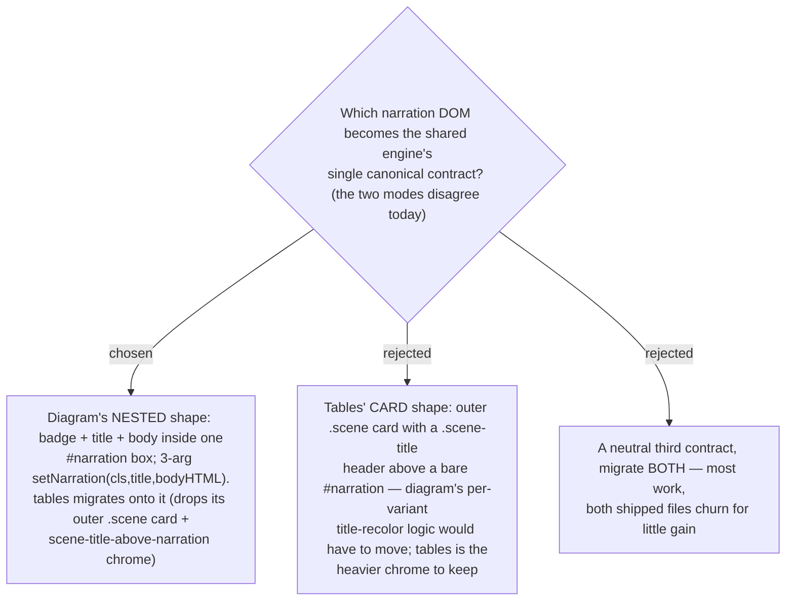

# Engine narration contract = diagram's nested shape; tables migrates onto it

The shared engine (ADR 0020) needs one canonical narration contract, but the two shipped
templates differ: diagram nests badge + title + body inside a single `#narration` box
with a 3-arg `setNarration(cls, title, bodyHTML)`, while tables wraps an outer `.scene`
card whose `.scene-title` header (badge + title) sits *above* a separate bare `#narration`
body, with a 2-arg `setNarration` plus a separate `setSceneTitle`. We adopt **diagram's
nested shape** as the engine contract because diagram is the stated default mode and its
narration already carries the per-variant title recoloring and the full
`warn/error/success/magic` variant set; **tables migrates onto it** (its outer card /
header-above chrome is replaced by the nested box). This is a real, user-visible change to
a shipped template — hence its own ADR — and it is the gating prerequisite: the engine
cannot be extracted until the narration contract is settled. The background token shift
that rides along with the `:root` hoist is reconciled to diagram's `#0a0e14` (the darker,
higher-contrast default).
