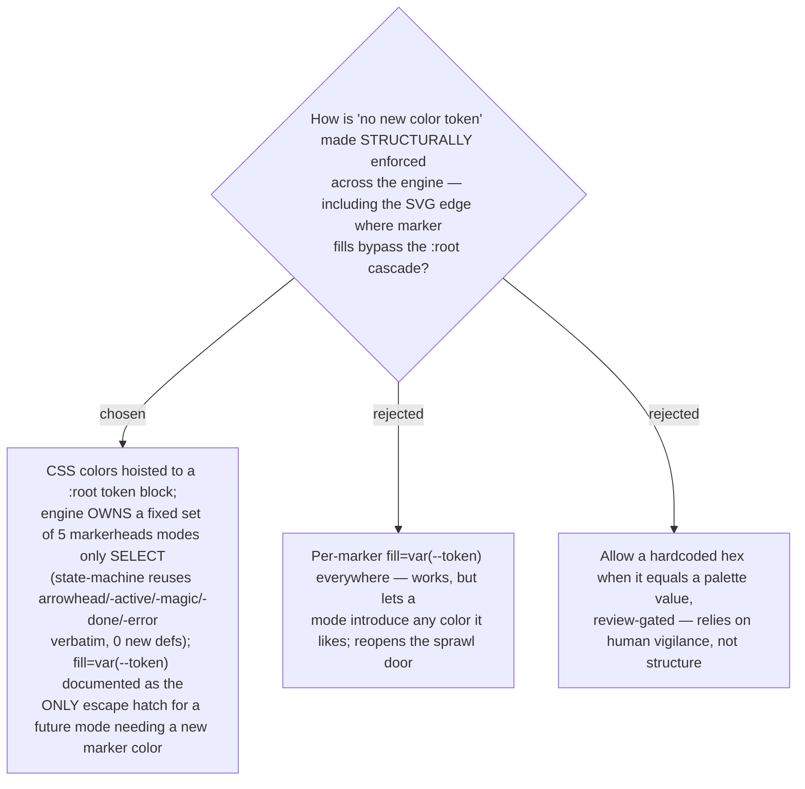

# Color-token discipline: :root for CSS, engine-owned fixed markerheads for SVG

The locked "no new color tokens" rule is enforced structurally by hoisting the palette to
a `:root` token block in the shared engine. The adversarial pass found this leaks at the
SVG edge: marker/arrowhead `fill` values are SVG presentation attributes that `:root`
custom properties cannot reach through normal cascade. So the **engine owns a fixed set of
5 markerheads** (the existing `arrowhead` / `-active` / `-magic` / `-done` / `-error`),
and modes may only **select** from them — the state-machine mode reuses them verbatim with
zero new `<marker>` defs. `fill="var(--token)"` is documented as the **only** escape hatch,
used solely if a future mode needs a marker color the fixed set lacks. The bespoke derived
hexes that are not single palette tokens — tables' `.target-conflict` gradient
(`#3a1818`→`#3a2810`) and diagram's per-variant `.step-title` recolors
(`#d4a4ff`/`#ff8888`/`#a3e8b9`) — are lifted **verbatim** into the engine during the
`:root` hoist, with a before/after visual regression check on both existing modes (the
hoist is a one-shot blast radius across all modes at once).
