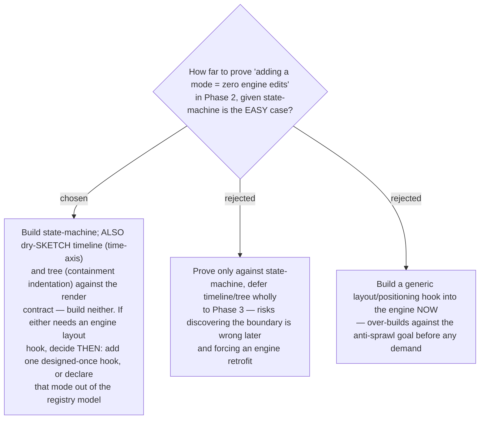

# Phase 2 dry-sketches timeline + tree against the render contract to verify additivity

The framework's success criterion is "adding a mode requires zero engine edits." The
adversarial pass established that state-machine satisfies it precisely *because* it is the
easy case — node/edge positions come from authored markup and states are class toggles, so
it maps onto the fixed `render()` slot with no engine layout hook. That leaves the criterion
proven where it is easiest and untested where it is hardest: a **timeline** needs a
continuous time-axis and a **tree** needs containment indentation, neither obviously
expressible as "set classes on pre-declared ids." So Phase 2 **builds state-machine and
additionally dry-sketches timeline and tree against the renderer contract** (no
implementation) — cheap insurance that the framework boundary holds before it is locked. If
either cannot express without an engine layout hook, that is decided then — add a single
designed-once layout hook, or declare that mode outside the registry model — rather than
discovering it during Phase 3 (forcing a retrofit) or pre-building a generic hook now
against the anti-sprawl goal.
