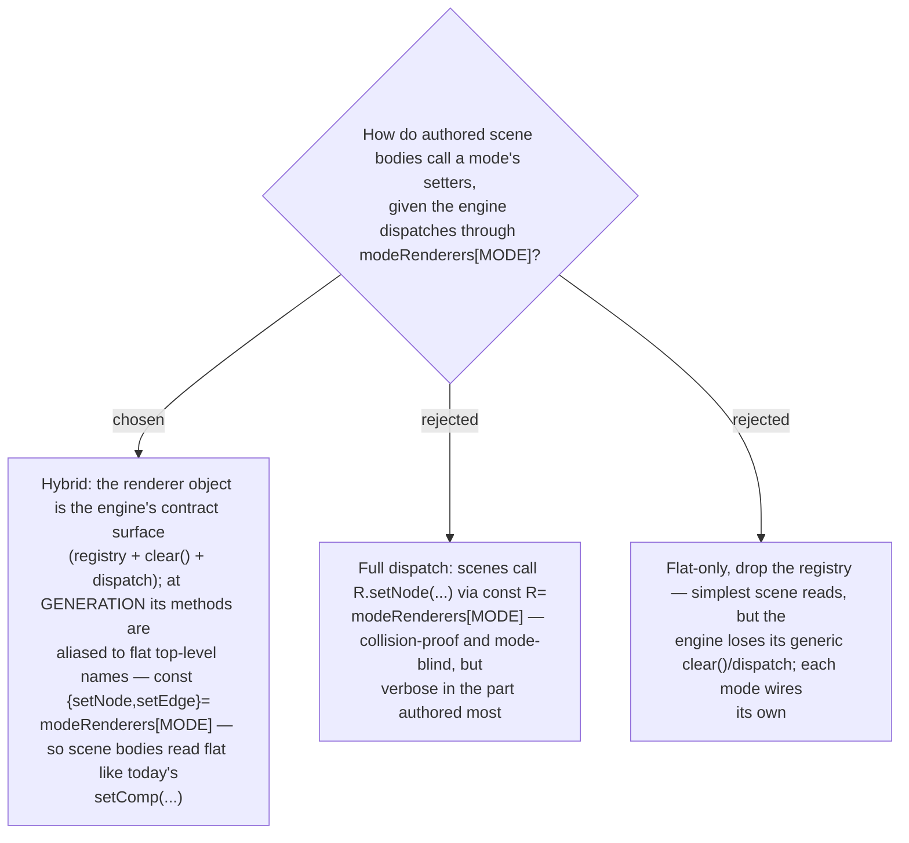

# Scene-authoring API: hybrid — engine keeps the renderer object, generation aliases methods to flat names

The renderer-registry (ADR 0020) gives the engine a clean, mode-blind contract via
`modeRenderers[MODE]`, but the indirection layer is its one real authoring-ergonomics
cost: scene bodies — the part an author writes most — would read `R.setNode(...)` instead
of today's flat `setComp(...)`. We take the **hybrid**: the renderer object stays the
engine's contract surface (it owns the id-registry, the replace-only setters, and the
`clear()` body the engine calls generically), but at **generation time** its methods are
aliased to flat top-level names (`const { setNode, setEdge } = modeRenderers[MODE]`) so
the authored scenes stay exactly as readable as today's. This keeps the structural wins
the judges valued — `R`-namespaced collision-proofing, a mode-blind engine, only the
chosen renderer inlined — while removing the ergonomic tax on scene authoring. Full
dispatch was rejected for verbose scene bodies; flat-only was rejected for losing the
engine's generic `clear()`/dispatch.
