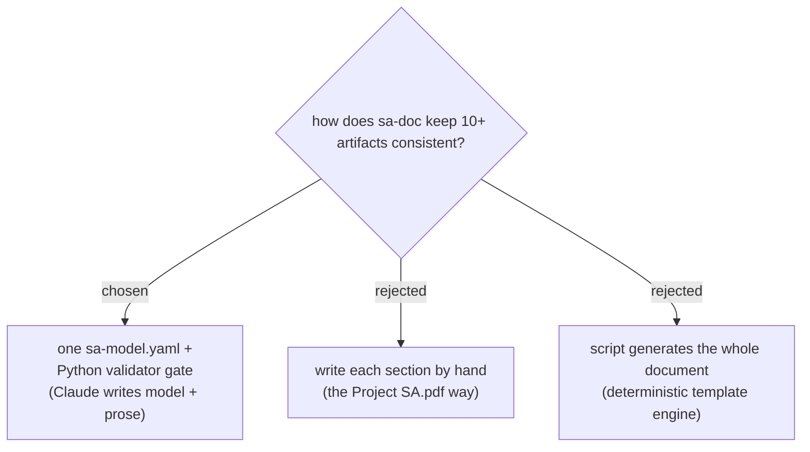

# 0025 — sa-doc generates every artifact from one validated central model

Status: accepted · Date: 2026-07-06

## Context

The reviewed `Project SA.pdf` (course SA&D report, 71 pages) carried 60
confirmed defects; 30+ were cross-artifact contradictions — features in scope
with no use case, sequences using fields no table stores, a boolean status
field vs a 3+-state lifecycle, three mutually exclusive technology stacks.
Root cause: every artifact was hand-written separately and copy-pasted.

## Decision

`sa-doc` derives every document section from a single `sa-model.yaml`
(schema: the skill's `references/model-contract.md`), and
`scripts/validate_model.py` gates generation — errors block, warnings need
explicit acceptance. Claude authors the model and the prose; the validator
owns referential integrity. The whole-document script generator was rejected
(wooden prose, rigid profiles); pure-discipline SKILL.md was rejected (the
consistency guarantee must be mechanical, not attentional).

## Consequences

- Editing the document = editing the model + regenerating; hand-patching the
  generated file is forbidden by the skill.
- The validator's rules are regression-tested against the defects of the
  reviewed specimen (`scripts/test_sa_model_validator.py`).
- Entity lifecycles introduced `stateDiagram-v2` into the diagram convention
  (Rule 2 table row added in the same change).
