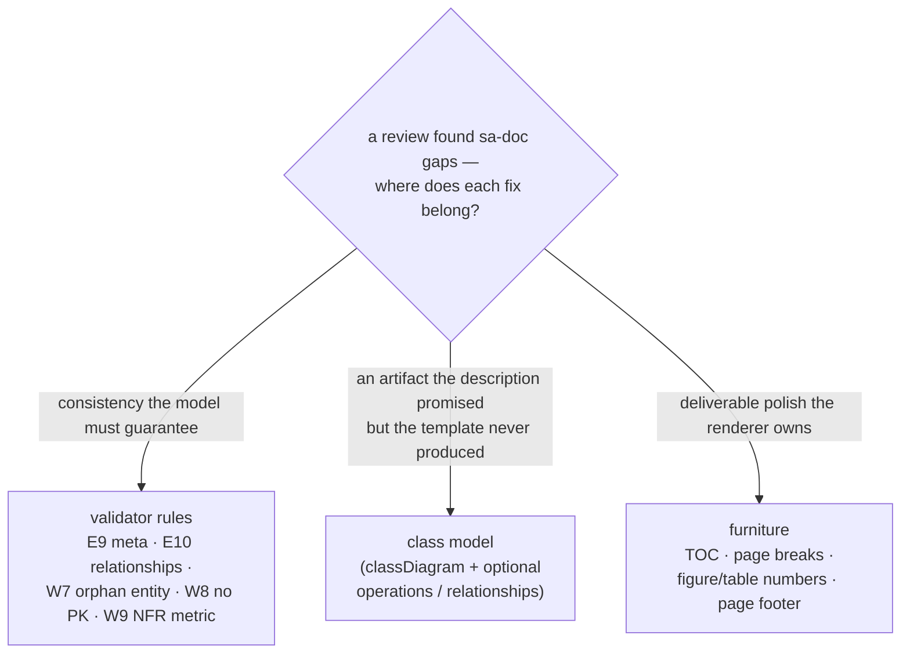

# 0026 — sa-doc: validator hardening, a class model, and document furniture

Status: accepted · Date: 2026-07-06

## Context

ADR 0025 established that sa-doc derives every artifact from one validated
`sa-model.yaml`. A follow-up review of the skill found gaps that undercut that
guarantee or the promised output:

- **The validator did not check `meta`.** A `profile` typo (`profesional`)
  slipped past E8's professional-security gate, silently generating a
  security-less professional document — the exact class of contradiction the
  validator exists to stop.
- **Orphan entities, key-less entities, and metric-less NFRs passed clean.** An
  entity no use case touches is drawn in the data model but never appears in
  traceability; an entity with no primary key cannot be keyed; an NFR with no
  metric cannot be verified.
- **The description promised a "class + ER model" but the template produced
  only an `erDiagram`.** No class diagram was ever generated.
- **NFRs and security controls floated untraced**, and functional requirements
  had no stable id (they were minted `FR-n` at generation time).
- **The rendered document had no table of contents, no page numbers, and no
  figure/table numbering** — furniture an academic report requires — and the
  PDF step used a fixed time budget with no completion signal.

## Decision

Fix each gap where it belongs, keeping every model addition **optional** so
existing models validate unchanged:

- **Validator** (`scripts/validate_model.py`): add errors **E9** (meta present
  with a concrete, valid `language`/`profile`) and **E10** (class-model
  `relationships` reference real entities and a known UML type); add warnings
  **W7** (orphan entity), **W8** (entity with fields but no primary key), **W9**
  (NFR with no measurable metric). Extend the E6 dangling-ref check to the
  optional `nfrs`/`security` trace refs and the optional `scope.id`.
- **Class model**: the data section now carries **two** diagrams — a
  `classDiagram` (OO/domain view, with optional `entities[].operations` and an
  optional top-level `relationships` list; associations derived from `fk` when
  none are given) and the existing `erDiagram` (database view). The diagram
  convention gained a `classDiagram` row (canonical wording changed only in
  `references/diagram-convention.md` per its header rule).
- **Traceability**: functional requirements may take a stable `scope.id`;
  `nfrs`/`security` may carry `objectives`/`use_cases` refs, surfaced as a
  quality chain in the traceability matrix.
- **Renderer** (`scripts/render_doc.py`): `<!-- sa-doc:toc -->` and
  `<!-- sa-doc:pagebreak -->` markers become a generated contents page and page
  breaks; figures and tables are auto-numbered with language-detected captions;
  `--page-numbers` keeps the browser footer; Mermaid render completion is
  flagged via `data-sa-render` and the time budget raised to 30s.

## Consequences

- The `sa-model.yaml` contract gained optional fields only; the bundled
  bookstore fixture was extended to exercise them and still validates
  `0 error, 0 warning`.
- Regression tests grew with the rules and the renderer
  (`test_sa_model_validator.py`, `test_render_doc.py`) and stay green.
- Page numbers depend on Chrome's default footer (date/URL shown too); a
  CDP-driven custom footer is a possible follow-up. DFD/context-diagram and
  screen-wireframe coverage remain out of scope (candidate future profiles).
