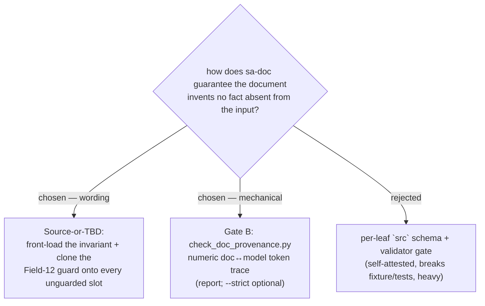

# 0027 — sa-doc enforces source-faithfulness (Source-or-TBD + a document gate)

Status: accepted · Date: 2026-07-06

## Context

A Study→Design→Verify audit (evidence folder: the fabrication-audit workflow)
asked where sa-doc can introduce facts absent from the user's input. The core
finding, re-verified against the code: **`validate_model.py` receives only the
model, never the source input, so it can check referential integrity but can
never verify provenance** — an invented-but-consistent value (a price, an NFR
metric, a field size, a citation, a security mechanism) passes the gate
silently. Worse, several validator rules create *fabrication pressure*: W9
(empty metric), W8 (no primary key) and E8 (professional ⇒ non-empty security)
nag the author to fill a blank, and the cheapest way to clear the nag is to
invent a plausible value rather than write `TBD`. The contract also claimed
"`TBD` is a legal value for any leaf" while E9 forbids it on meta — and several
template fields (Field 5 *interests*, professional *Security design*/*Deployment
view*, academic *literature*/*budget*) plus schema leaves solicited content with
no model source and no `—/TBD` guard. Field 12 *Frequency* already carried the
exemplar guard ("stated in the input/model, else '—' — never invent a number");
nothing else did.

## Decision

Two layers, adopted from the design panel's verified recommendation:

- **Source-or-TBD (wording, zero-regression).** Front-load one inviolable
  invariant in `SKILL.md` — every value traces to the input or is `TBD`; the
  validator cannot enforce this, so the rule does. Broaden the never-invent list
  from "actors, fields, prices, rules" to every fact class (numbers, metrics,
  sizes, samples, cardinalities, dates, states/triggers, architecture, security
  controls, budget, citations, interests). Clone Field 12's triple-guard
  (source-pointer / else "—" / never-invent) onto Fields 2, 3, 5, 11, 13 and the
  professional/academic profile sections; fix the "any leaf" contradiction in
  the contract; add per-leaf reminders and a pre-write provenance self-check.
- **Gate B (mechanical).** `scripts/check_doc_provenance.py` traces every hard
  numeric fact in the generated document back to a model value, enforcing
  "prose connects, never introduces" that the validator cannot. Report mode by
  default (each finding resolved like a warning); `--strict` blocks. Scoped to
  numbers to stay low-false-positive; structural numbers (headings, list
  markers, id suffixes, table index/step cells) are exempt, and diagrams/code
  fences skipped. Intake now persists raw input to `SA-<project>/.source/` so a
  future source-aware check has a file.

**Rejected — per-leaf `src` schema + validator enforcement (Design 1):** the
`src` is written by the same LLM that could fabricate the value (self-attested),
it silently breaks the clean fixture and the in-code `base_model()` tests, and
it roughly doubles authoring effort. Deferred; its only adopted idea is the
`TBD`-contradiction fix (also in Design 2).

## Consequences

- Faithfulness is now defended in depth: wording closes the soft-prose class,
  Gate B mechanically catches the hard-numeric class; neither depends on the
  validator, which structurally cannot help.
- Honest documents will carry **more `TBD`s** — the intended, correct failure
  mode when the input is silent, not incompleteness to paper over.
- Residual, stated plainly: nothing verifies a non-numeric fabrication (an
  invented actor name, a plausible prose sentence) beyond wording discipline;
  Gate B's report mode means an author can ignore findings. The source-aware
  quote check (Design 1's E13) remains a possible successor once `.source/`
  intake is proven.
- New tests: `test_check_doc_provenance.py` (9). Validator/renderer stdout
  hardened to UTF-8 so Thai findings do not crash a Windows cp1252 console.
