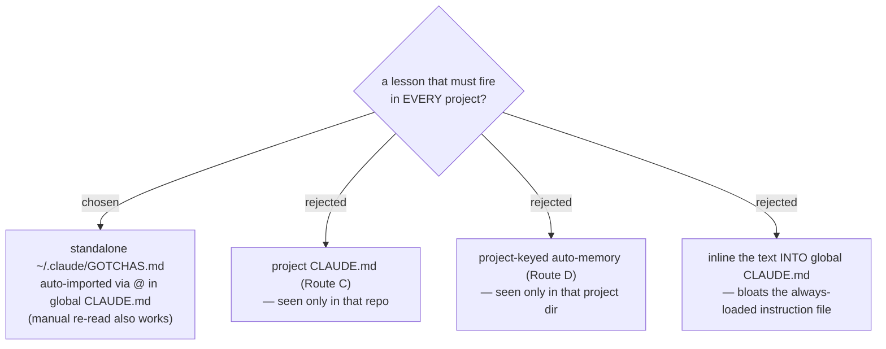

# ADR 0028 — reflect files cross-project gotchas in ~/.claude/GOTCHAS.md, auto-imported via @

- **Status:** Accepted
- **Date:** 2026-07-12

## Context

reflect already routes lessons to where they will fire again: an owned skill
(A), a new skill (B), the **project** CLAUDE.md (C), or **project-keyed**
auto-memory (D). But C and D are both scoped to a single project — Route C is
visible only inside that repo, and Route D's memory lives under a
directory-keyed path (`c--Repo2-workflow-daily-work/memory/`). There was **no
destination for a gotcha that must fire in every project** — e.g. "PowerShell
5.1 has no `&&`", "the mobile-app write-guard flips drive-letter case within a
session". Such a lesson learned in project X is invisible in project Y.

The only mechanism that reaches every session across all projects is the
**global** `~/.claude/CLAUDE.md`, which Claude Code auto-loads everywhere.

## Decision

Cross-project gotchas get a dedicated destination: a standalone
**`~/.claude/GOTCHAS.md`**, wired into the global `~/.claude/CLAUDE.md` with a
single `@~/.claude/GOTCHAS.md` import line so Claude Code **auto-loads it in
every session across every project** — the AI reads it itself, no manual step.
Because it is a real file at a stable path, the user can also **re-read it on
demand** at any time (`@GOTCHAS.md` / "read the gotchas again").

The file is kept **separate** from CLAUDE.md (not inlined) so the gotcha list
can grow without bloating the hand-written global instructions, and so it stays
a single greppable knowledge file.

## Consequences

- ➕ A gotcha learned in one project now fires in all of them.
- ➕ Single `@` line to wire; the file is human- and grep-friendly.
- ➖ It is auto-loaded into **every** session, so it costs context budget
  forever — mitigated by a terse one-line-per-gotcha format and dedup/expiry
  discipline (see follow-on ADRs) rather than by making it manual.

## Alternatives considered

- **Route C / project CLAUDE.md** — rejected for cross-project lessons: only
  visible in the repo it was written to.
- **Route D / auto-memory** — rejected: the memory store is keyed by project
  directory, so a memory written in project X never surfaces in project Y.
- **Inline the gotchas into global CLAUDE.md** — rejected: mixes a growing
  auto-harvested list into hand-curated instructions and bloats the file that
  loads on every turn.
- **Manual-only (`@GOTCHAS.md` when needed)** — rejected as the default: relies
  on the user remembering to ask, defeating "fire automatically". Kept as an
  available extra, not the primary path.
