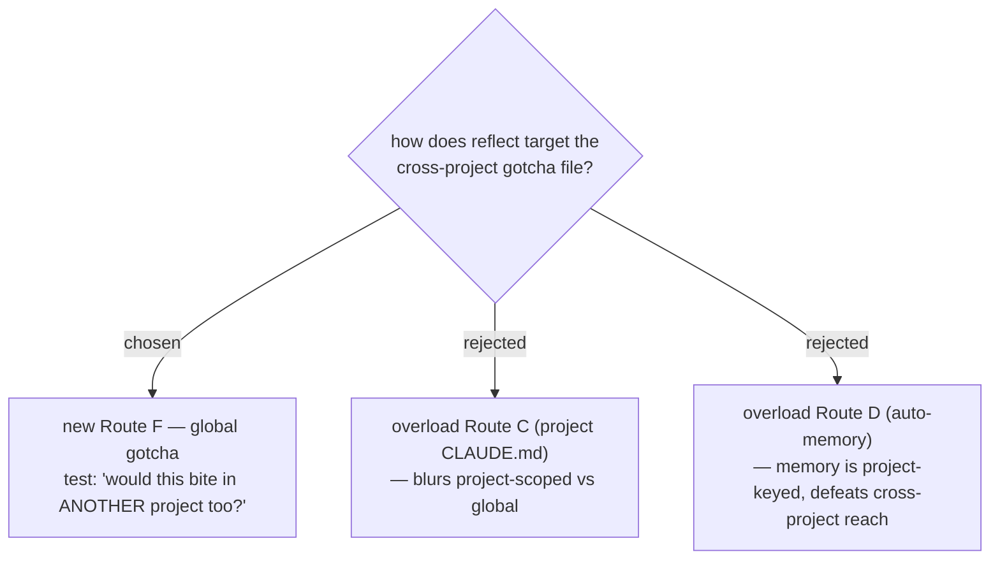

# ADR 0029 — reflect gains Route F (global gotcha), reclaiming cross-project tooling lessons from Route D

- **Status:** Accepted
- **Date:** 2026-07-12

## Context

ADR [0028](0028-reflect-cross-project-gotchas-file.md) established the
destination (`~/.claude/GOTCHAS.md`). This ADR decides how reflect **selects**
it. reflect's existing routing table (A/B/C/D/E) has no slot whose meaning is
"applies everywhere". In practice, cross-project tooling/environment lessons —
e.g. the mobile-app write-guard flipping drive-letter case, PowerShell 5.1
lacking `&&` — were being filed to Route D (auto-memory), which is keyed by
project directory and therefore invisible in other projects. The lesson was
captured but routed where it could not fire again.

## Decision

Add **Route F — global gotcha** to reflect's routing table, destination
`~/.claude/GOTCHAS.md` (ADR 0028). The selection test is a single question:

> **"If I did this in another project, would this same thing bite me?"**

- **Yes** → Route F. Tooling quirks, harness/hook behaviors, cross-cutting
  environment traps, language/shell gotchas.
- **No, it is this project's own convention or architecture** → Route C
  (project CLAUDE.md).
- **A personal preference or a single-project fact** → Route D (auto-memory).

Route F explicitly **reclaims** the cross-project tooling/environment lessons
that previously defaulted to Route D. Route D keeps genuinely single-project
facts and personal preferences.

## Consequences

- ➕ Cross-project lessons finally land where they fire in every project.
- ➕ The F-vs-D boundary is a one-line test, easy to apply under pressure.
- ➖ Some past Route-D memories are really Route-F gotchas; migrating them is
  out of scope here (reflect will route future ones correctly; a manual sweep
  can promote old ones if desired).

## Alternatives considered

- **Overload Route C** — rejected: Route C means "this project's convention";
  widening it to "and also anything global" destroys the distinction that makes
  the table legible.
- **Overload Route D** — rejected: auto-memory is directory-keyed, so it
  structurally cannot reach other projects; this is exactly the gap being fixed.
