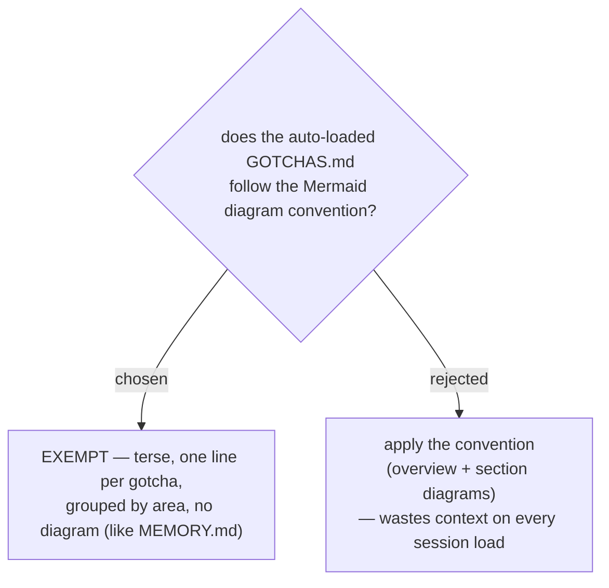

# ADR 0030 — GOTCHAS.md is a terse one-line-per-gotcha file, exempt from the Mermaid diagram convention

- **Status:** Accepted
- **Date:** 2026-07-12

## Context

The diagram convention (ADRs [0005](0005-mermaid-diagrams-in-generated-documents.md)–[0009](0009-adrs-carry-decision-diagrams-glossary-exempt.md))
says every skill-generated Markdown **document** opens with an overview Mermaid
diagram plus type-matched section diagrams, and the owner prefers uniformity.
But `~/.claude/GOTCHAS.md` (ADR 0028) is **auto-loaded into every session via
`@`**, so any bytes it carries cost context budget on every turn, forever. A
diagram there buys nothing and is paid for continuously. It is also not a
deliverable "document" — it is an index/knowledge file, the same category as
`MEMORY.md`, which the memory scheme already keeps diagram-free and terse.

## Decision

`GOTCHAS.md` is **exempt** from the diagram convention and follows a terse,
greppable format:

- **One gotcha = one line.** A bold short title (which doubles as the dedup key)
  + the fix/workaround + a trailing `(YYYY-MM-DD)` date for review/expiry.
- **Grouped under `##` area headings** (Shell, hooks/harness, Azure/ADO, …);
  reflect creates a new heading lazily when no existing group fits.
- **No overview or section Mermaid diagrams.**

This mirrors the existing glossary/MEMORY.md exemptions — uniformity yields to
context economy for files that load on every turn.

## Consequences

- ➕ The always-loaded file stays as small as possible; it grows by one line per
  real gotcha, not by diagram scaffolding.
- ➕ Bold-title-as-key makes dedup ("update beats create") a simple line match.
- ➖ One more exemption to the "every .md has a diagram" rule. Mitigated by
  recording it here and scoping it narrowly to always-loaded index files
  (GOTCHAS.md, MEMORY.md), not deliverable documents.
