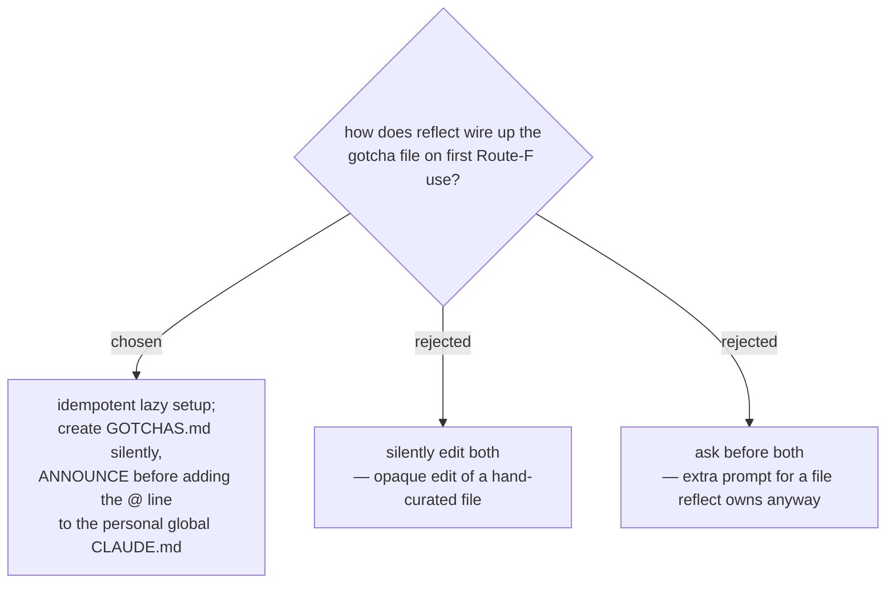

# ADR 0031 — reflect provisions GOTCHAS.md idempotently, and announces before editing the personal global CLAUDE.md

- **Status:** Accepted
- **Date:** 2026-07-12

## Context

The first time reflect applies a Route-F finding (ADR 0029) it must ensure two
things exist: the destination `~/.claude/GOTCHAS.md`, and the
`@~/.claude/GOTCHAS.md` import line inside `~/.claude/CLAUDE.md` that makes it
auto-load (ADR 0028). GOTCHAS.md is reflect's own harvested artifact; the global
CLAUDE.md is the user's **hand-written personal instruction file**. These two
files deserve different levels of ceremony.

## Decision

reflect provisions the wiring **lazily and idempotently** as part of Stage 4
(applying an already-approved finding):

- **Check before write, always.** If GOTCHAS.md is missing, create it with the
  header; if present, append/update in place — never clobber. If the `@` import
  line is already present in the global CLAUDE.md, do nothing.
- **Create GOTCHAS.md without extra prompting** — it is reflect's own artifact
  and the finding is already approved.
- **Announce before editing the global CLAUDE.md** the first time — tell the
  user "adding one `@import` line to your global CLAUDE.md" and then add it
  (append at end with a one-line comment). Editing a personal instruction file
  should be transparent, even when authorized.

## Consequences

- ➕ Re-running reflect never duplicates the import line or clobbers gotchas.
- ➕ The user's personal CLAUDE.md is never edited invisibly.
- ➖ A one-time sentence of ceremony on first use — deliberate, not overhead.

## Implementation notes (verified against Claude Code docs, 2026-07-12)

- The import line MUST be written **plain**, e.g. `@~/.claude/GOTCHAS.md` — NOT
  inside backticks or a fenced code block. Claude Code's import parser skips
  code spans/fences, so a backticked `@...` is treated as literal text and never
  loads.
- Adding the import triggers a **one-time approval dialog** on the next session
  ("the first time Claude Code encounters external imports … it shows an approval
  dialog; if you decline, the imports stay disabled and the dialog does not
  appear again"). reflect's transparency announcement therefore also tells the
  user to **approve that dialog** so the gotchas actually auto-load.
- `~/.claude/CLAUDE.md` loads in every session/working directory (Claude Code
  walks up the directory tree), which is what makes the gotchas cross-project.
