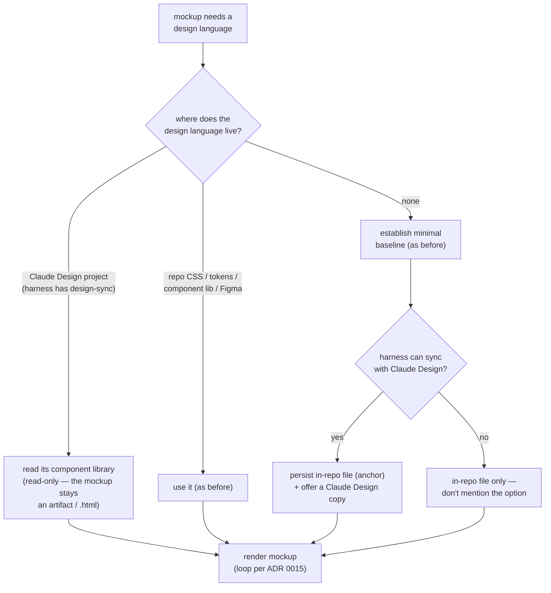

# ADR 0032 — ui-mockup gains Claude Design as an optional design-language source and baseline home

- **Status:** Accepted
- **Date:** 2026-07-17

## Context

ADR [0015](0015-grill-then-plan-ui-mockup-in-loop.md) gave grill-then-plan a
mockup-in-the-loop step whose mechanism lives in a single shared reference,
`plugins/dev-workflows/references/ui-mockup.md` (shareable by design — though as of
this ADR, grill-then-plan's Step 3.5 is the only skill that points at it; the
grill-with-docs port outside this repo carries no mockup step yet). That
reference names the places a mockup's design language may come from — repo CSS/theme,
a component library, Tailwind/token config, or a Figma design system via "your
harness's Figma mechanism" — and, when none exists, has the skill propose a minimal
baseline persisted as a project file.

Some harnesses can now read and write **Claude Design** projects — design-system
projects on claude.ai/design — through a design-sync mechanism (in Claude Code, the
`DesignSync` tool paired with `/design-sync`): list a project's component library,
read files, create a project, and sync files into it incrementally. The owner asked
for grill-then-plan's mockup step to use it.

Two constraints bound the shape. Skills must stay **harness-neutral** (CLAUDE.md):
Antigravity has no design-sync mechanism, and even on Claude Code it requires a
claude.ai login with design scopes — so it can only ever be an optional enhancement
with the existing fallback intact. And ADR 0015 fixed the **single-reference
pattern**: the mechanism lives only in `ui-mockup.md`; nothing else restates it.

## Decision

`ui-mockup.md` gains Claude Design at two points, both worded as a harness
*capability* ("your harness's design-sync mechanism") with the existing behavior as
fallback:

- **Design-language source (read-only).** A Claude Design project joins the list of
  places to pull the design language from, alongside repo CSS/theme, component
  libraries, token configs, and Figma. Read its component library; the mockup itself
  is still rendered as an artifact / self-contained `.html` and is **never uploaded
  to the project**.
- **Baseline home (offer, don't require).** When the no-design-system path produces
  an approved starter baseline, a harness that can sync offers to *also* persist it
  as a Claude Design design-system project the user can browse and reuse across
  tools. The in-repo file **remains the canonical anchor** the build inherits; the
  Claude Design copy never replaces it. A harness without the mechanism keeps the
  local file only and does not mention the option.

The mechanism stays in the single shared reference, so any grilling skill that
later points at it picks both behaviors up with no separate edit — today that is
grill-then-plan's Step 3.5 only.

## Consequences

- ➕ Mockups can render in the user's real, cross-tool design language instead of
  stopping at "no design system found in the repo."
- ➕ An approved starter baseline becomes a browsable, reusable design-system project
  rather than a file only this repo knows about.
- ➕ Harness-neutrality preserved: capability-worded, observable predicate (the
  mechanism exists or it doesn't), full fallback path unchanged — Antigravity
  behavior is byte-for-byte what it was.
- ➖ The Claude Design path needs a claude.ai login with design scopes; headless runs
  may lack it. Mitigation: it is an offer/enhancement, never a dependency.
- ➖ One more branch in the render step. Mitigation: the branch keys on a mechanical
  check, not a judgment call.

## Alternatives considered

- **Name the DesignSync tool / `/design-sync` skill in the reference** — rejected:
  violates harness-neutrality; the file's own precedent is "your harness's Figma
  mechanism", and this follows it.
- **Publish each mockup to the Claude Design project** — rejected: design-sync is an
  incremental component-library sync, not a screen dump; one-off grilling mockups
  would pollute the design system. The artifact/`.html` loop of ADR 0015 stands.
- **Make Claude Design the primary baseline home (replace the repo file)** —
  rejected: the build inherits the baseline from the repo, and claude.ai isn't
  reachable from every harness or session. The repo file stays the anchor.
- **Add the behavior to SKILL.md Step 3.5** — rejected: ADR 0015's single-reference
  pattern; Step 3.5 points at `ui-mockup.md` and nothing else restates the mechanism.
