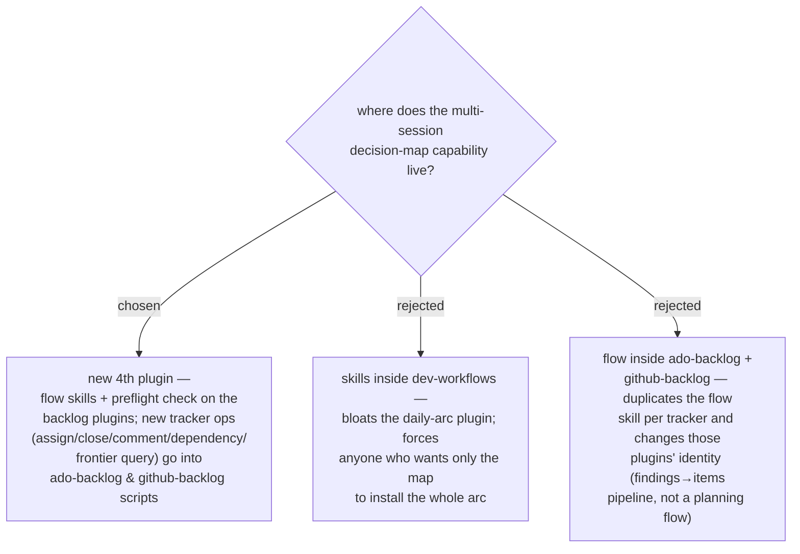

# ADR 0033 — the wayfinder-style decision-map capability lands as a fourth plugin

- **Status:** Accepted — **superseded in part by
  [ADR 0059](0059-v1-ships-local-backend-only-tracker-backends-deferred.md)**:
  the fourth-plugin decision stands, but the tracker ops this ADR places in
  `ado-backlog` / `github-backlog` are deferred to phase 2 and do not exist in
  v1. The **Step-0 preflight on the backlog plugins described here is not
  performed** — both flow skills refuse to offer a tracker install and say
  decision-map cannot use a tracker yet.
- **Date:** 2026-07-31

## Context

The marketplace has no capability for work **too big for one agent session**: every
arc skill is single-session-sized (grill-then-plan emits one spec per sitting;
`daily-state.md` resumes exactly one focus, ADR 0014). Adapting the wayfinder idea —
a map of decision tickets on the issue tracker, resolved one session at a time —
needs a home. Tracker machinery (auth, org/project config, create scripts, safety
gates) already lives in `ado-backlog`/`github-backlog`; the daily flow lives in
`dev-workflows`. Cross-plugin composition has two precedents: the `/daily` router
hands off to `ado-backlog:my-work` (PLAYBOOK-level), and grill-then-plan's Step 0
preflight-checks its superpowers dependency before starting.

## Decision

The capability becomes a **new, fourth plugin** in the marketplace. It owns the
flow skills (charting the map, working through it) and **preflight-checks** that a
backlog plugin (`ado-backlog` or `github-backlog`) is installed, the same way
grill-then-plan checks superpowers. The tracker operations the flow needs but the
scripts lack today — assign/claim, close, comment, dependency/blocking links,
frontier query — are added to the **backlog plugins' scripts**, which stay the sole
owners of their tracker's machinery. The new plugin never talks to a tracker
directly.

## Consequences

- ➕ Installable à la carte; `dev-workflows` stays the daily arc, backlog plugins
  keep their findings→work-items identity.
- ➕ Tracker ops land where auth + safety gates already live; both trackers gain
  reusable primitives other skills can call.
- ➖ A hard cross-plugin dependency — mitigated by the Step-0 preflight pattern
  (detect, offer install, never start a session that can't finish).
- Follow-ups this ADR does not settle: the plugin's name, v1 tracker scope, and how
  ticket resolutions relate to the ADR store.
