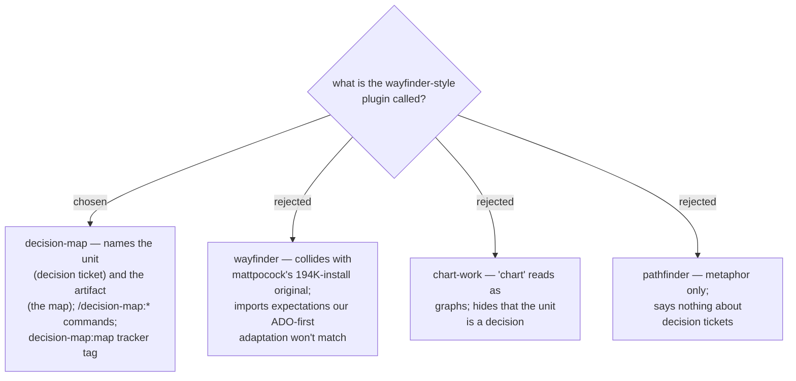

# ADR 0034 — the fourth plugin is named `decision-map`

- **Status:** Accepted
- **Date:** 2026-07-31

Descriptive over homage: the upstream skill itself just renamed its unit to
"decision ticket" because people mis-read tickets as implementation slices — our
name bakes that lesson in from the start. The plugin dir, command prefix
(`/decision-map:<skill>`), tracker tag/label prefix (`decision-map:map`), and
glossary terms all derive from this name.
