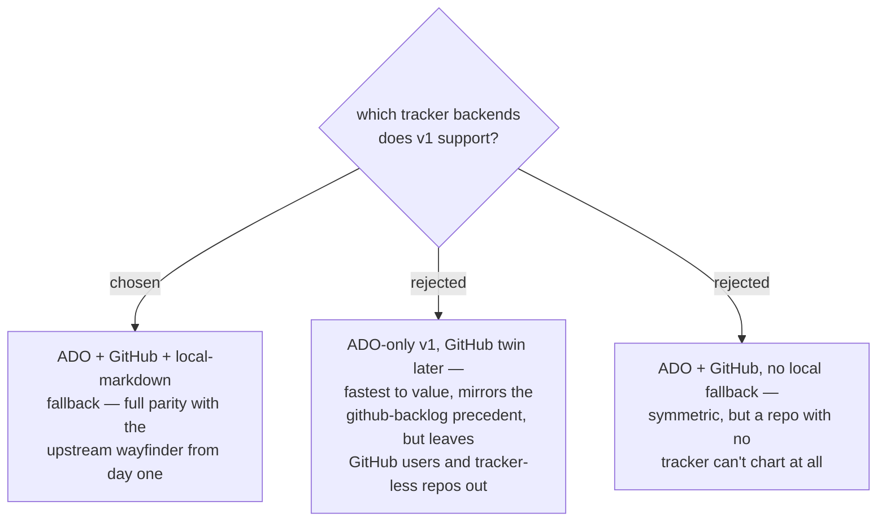

# ADR 0035 — decision-map v1 supports ADO + GitHub + a local-markdown fallback

- **Status:** Accepted — **superseded in part by
  [ADR 0056](0056-v1-ships-local-backend-only-tracker-backends-deferred.md)**:
  v1 ships the local-markdown backend only, and ADO + GitHub become phase 2,
  gated on the live-API probe. The tracker design decided here stands as that
  phase's specification.
- **Date:** 2026-07-31

## Context

Upstream wayfinder is tracker-agnostic with a local-markdown default when no
tracker is wired. Our machinery is uneven: ADO scripts already have parent-child
links + dry-run gates and the platform has native `Dependency-Forward/Reverse`
blocking; GitHub's native sub-issues / "blocked by" dependencies are newer and
unused by our scripts; a local map is a new state file in a repo that already has a
deliberate two-state-store boundary (`daily-state.md` + repo docs, ADR 0014).

## Decision

v1 ships **all three backends**: ADO (native hierarchy + dependency links), GitHub
Issues (native sub-issues/dependencies where the plan supports them, body-convention
`blocked-by: #N` fallback where it doesn't), and a **local-markdown map** for repos
with no tracker — full functional parity with the upstream skill. The owner chose
completeness over the recommended ADO-first slice: the plugin should be installable
by anyone in the marketplace's audience on day one, not just ADO users.

## Consequences

- ➕ Day-one parity; the preflight (ADR 0033) can satisfy on *either* backlog plugin,
  or on nothing (local fallback) — the capability never dead-ends.
- ➖ Three backends triple the ops surface; mitigated by keeping ops in the backlog
  plugins (ADR 0033) behind one shared operations contract.
- ➖ GitHub blocking semantics are plan-dependent; the body-convention fallback is
  weaker (no board-visible frontier) and must be labelled as such in the skill.
- ⚠ The local-markdown map adds a third state artifact next to `daily-state.md` and
  repo docs — its home and its relation to the ADR 0014 boundary are deliberately
  **not settled here**; a follow-up decision must place it so the two-store boundary
  survives.
