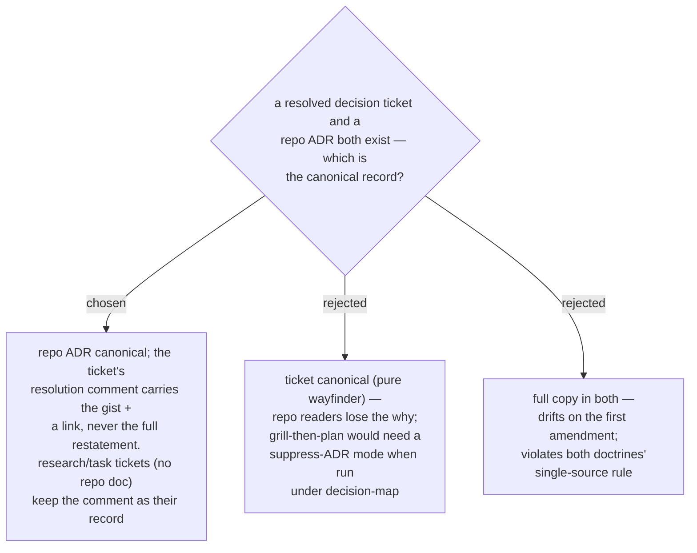

# ADR 0036 — the repo ADR stays canonical; a decision ticket only gists and links it

- **Status:** Accepted
- **Date:** 2026-07-31

## Context

Wayfinder doctrine: *a decision lives in exactly one place — its ticket*; the map
only gists and links. This repo's doctrine (grill-then-plan Step 4): *every design
decision becomes a repo ADR the moment it is made*. A decision ticket resolved by
grill-then-plan would otherwise produce two full records at once.

## Decision

Extend wayfinder's own indexing principle one level down. The chain is
**map → gist+link → ticket → gist+link → repo ADR**: when a resolver skill writes
repo docs (an ADR, a CONTEXT.md term), the ticket's resolution comment states the
answer in one or two lines and links the ADR/commit — never restates it. When the
resolver produces no repo doc (research findings, task completions), the resolution
comment **is** the canonical record, exactly as upstream wayfinder has it. Resolver
skills keep their inline-ADR behavior unchanged — no special mode when running
under decision-map.

## Consequences

- ➕ Single source holds everywhere; both audiences served (tracker readers get the
  gist, repo readers keep the engineering record next to the code).
- ➕ Zero behavior change to grill-then-plan and friends.
- ➖ A ticket is not self-contained when an ADR exists — the reader must follow one
  link for full rationale. Accepted: that is already how the map treats tickets.
