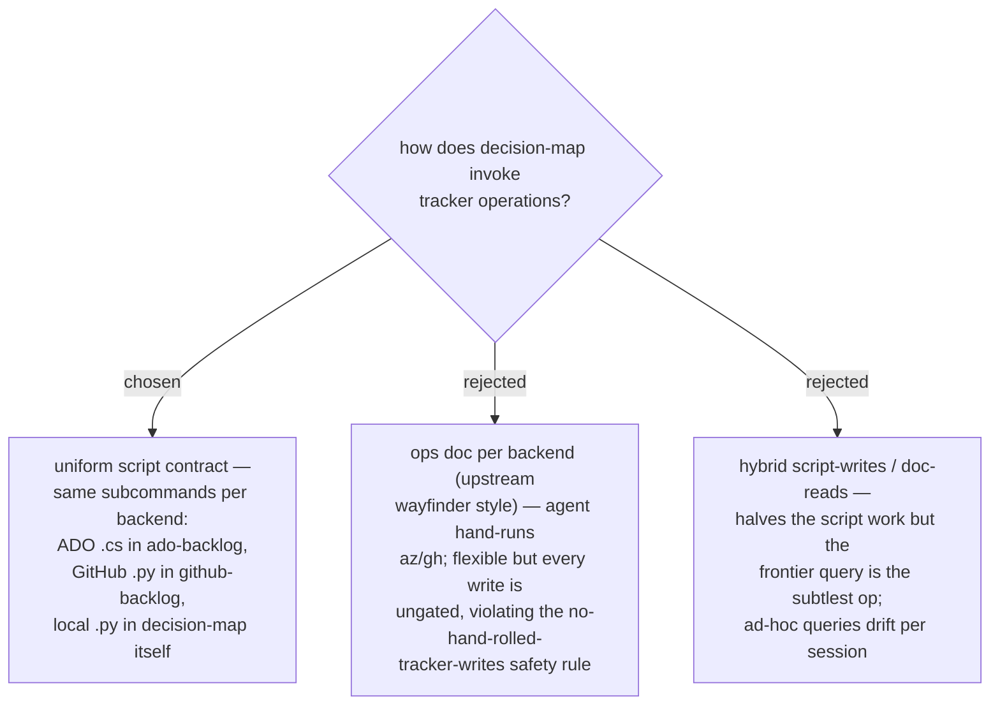

# ADR 0037 — one ops-script contract, three backend implementations

- **Status:** Accepted
- **Date:** 2026-07-31

## Context

Upstream wayfinder expresses tracker ops as documentation the agent consults and
hand-executes. This repo's convention is the opposite for anything that writes to a
tracker: deterministic scripts with the dry-run gate built in (`create-backlog.cs`,
`validateOnly=true`), and a standing rule against hand-rolled tracker writes.
decision-map needs seven ops across three backends: chart (bulk map+ticket create),
claim, resolve (comment+close), comment, block-link, frontier query, and map read.

## Decision

Every backend implements the **same subcommand contract** in one executable owned by
the plugin that owns that backend (ADR 0033): ADO as a `.cs` file-based app in
`ado-backlog/scripts/`, GitHub as a `.py` in `github-backlog/scripts/`, and the
local-markdown fallback as a `.py` in `decision-map/scripts/`. The decision-map flow
skills call whichever backend the preflight resolved — they never touch a tracker
API directly. The shapes the scripts exchange (`map.json`: map id + tickets
`{key, type, blocks[], status, gist}`) are defined **once** in
`plugins/decision-map/references/data-contracts.md`, mirroring the ado-backlog
data-contract pattern; the tracker itself stays the source of truth — the local
JSON is a working file, not a store.

## Consequences

- ➕ Dry-run and approval gates live inside the write path on all three backends;
  frontier semantics are identical everywhere (a body-convention fallback on GitHub
  is the script's internal concern).
- ➕ Reusable primitives: other skills (e.g. a future my-work frontier view) call the
  same scripts.
- ➖ Three implementations to keep in contract lockstep — mitigated by the single
  schema file and a shared conformance checklist in the plugin docs.
