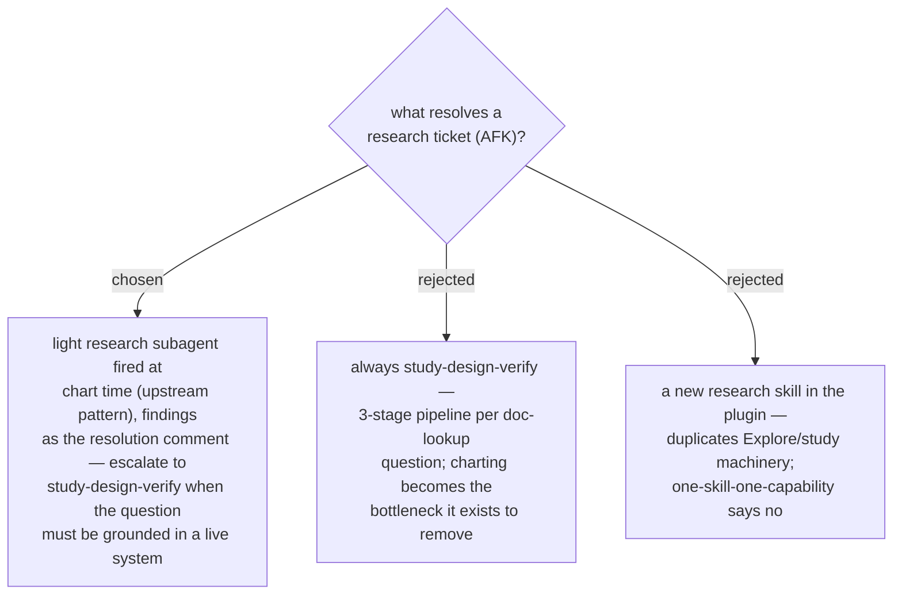

# ADR 0038 — ticket types resolve via existing arc skills; research is a light subagent with an escalation path

- **Status:** Accepted
- **Date:** 2026-07-31

## Context

Upstream wayfinder types every ticket **HITL** (resolved only through live human
exchange — the agent never answers its own questions) or **AFK** (agent-driven), and
fires `/research` subagents in parallel at chart time. Three of the four types map
straight onto the existing arc; only research had no obvious owner —
`study-design-verify` is the closest skill but is a heavyweight three-stage
pipeline.

## Decision

The v1 mapping, recorded as the plugin's resolver table:

| Type | Mode | Resolver |
|---|---|---|
| grilling (default) | HITL | `grill-with-docs` / `grill-then-plan`; a fix-shaped ticket inherits the ADR 0003/0011 invariant (debug-mantra verifies the cause first) |
| prototype | HITL | the ui-mockup mechanism (DesignSync per ADR 0032; Artifact / `.html` fallbacks) |
| research | AFK | **light research subagents** fired in parallel at chart time, findings posted as the resolution comment; **escalate to `study-design-verify`** when the answer must be grounded in a live system (schema, org, real code) — the skill carries the escalation criterion |
| task | HITL or AFK | agent executes directly where it can; otherwise hands the human a precise checklist |

## Consequences

- ➕ Zero new resolver skills; the plugin composes the arc instead of duplicating it.
- ➕ Charting stays fast (research burns down in parallel) without giving up
  evidence-grounded rigor where it matters.
- ➖ The light-vs-escalate boundary is a judgment call; mitigated by writing the
  criterion into the skill ("outside knowledge → light; live-system truth → SDV").
