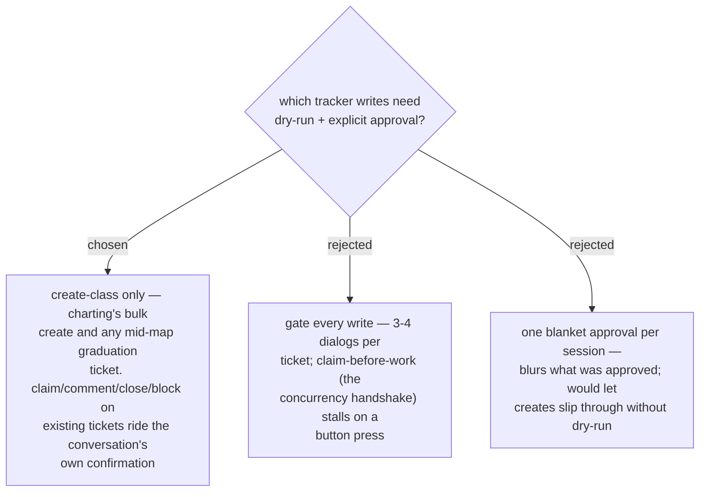

# ADR 0039 — decision-map gates create-class writes; lifecycle writes flow with in-conversation confirmation

- **Status:** Accepted
- **Date:** 2026-07-31

## Context

The repo's standing gates say *never create without a passing dry-run and explicit
approval*. decision-map adds chatty lifecycle writes the pipeline never had: claim
(assign-to-self **before any work** — the upstream concurrency handshake), resolution
comments, closes, blocking links. Gating each one breaks the work-through cadence;
gating none violates "assisted, never automatic" (ADR 0014's git precedent).

## Decision

Two tiers. **Create-class writes** — the chart-time bulk create of map + tickets,
and every ticket created mid-map when fog graduates — inherit the full gate:
dry-run first, explicit user approval, then the real run. **Lifecycle writes** on
already-existing tickets flow without a separate dialog, because their approval
already happened in the conversation: a claim executes when the user picks (or
accepts) the ticket to work; a resolution comment + close executes when the user
confirms the answer during grilling; a blocking link executes as part of an
approved graduation. The ops scripts (ADR 0037) still support `--dry-run` on every
subcommand for diagnostics — the tier controls when a *dialog* is required, not
what the scripts can do.

## Consequences

- ➕ The irreversible/visible act (new items appearing on a shared board) keeps the
  strong gate; the per-ticket cadence stays conversational.
- ➕ Claim stays instant, so concurrent sessions skip claimed tickets reliably.
- ➖ A hostile prompt could phrase a close as "confirmed" — mitigated: the close must
  quote the user's confirming message in the resolution comment, an auditable trail.
