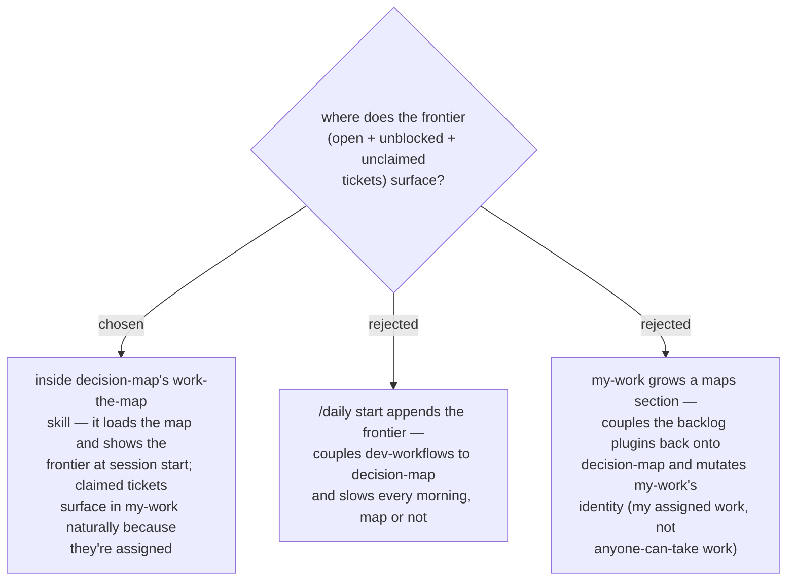

# ADR 0040 — the frontier view lives in decision-map; my-work stays untouched

- **Status:** Accepted
- **Date:** 2026-07-31

decision-map enters the daily arc as a **WORK-router branch** ("work too big for
one session") with PLAYBOOK rows in the same commit (ADR 0001) — never a sixth
station (ADR 0004). The frontier is decision-map's own view, rendered by the
work-the-map skill from the ops scripts' frontier query (ADR 0037). The backlog
plugins keep their one-directional role: decision-map depends on them, never the
reverse. A claimed ticket appears in `my-work` with no integration at all —
claiming assigns it to you, and my-work lists assigned items.
