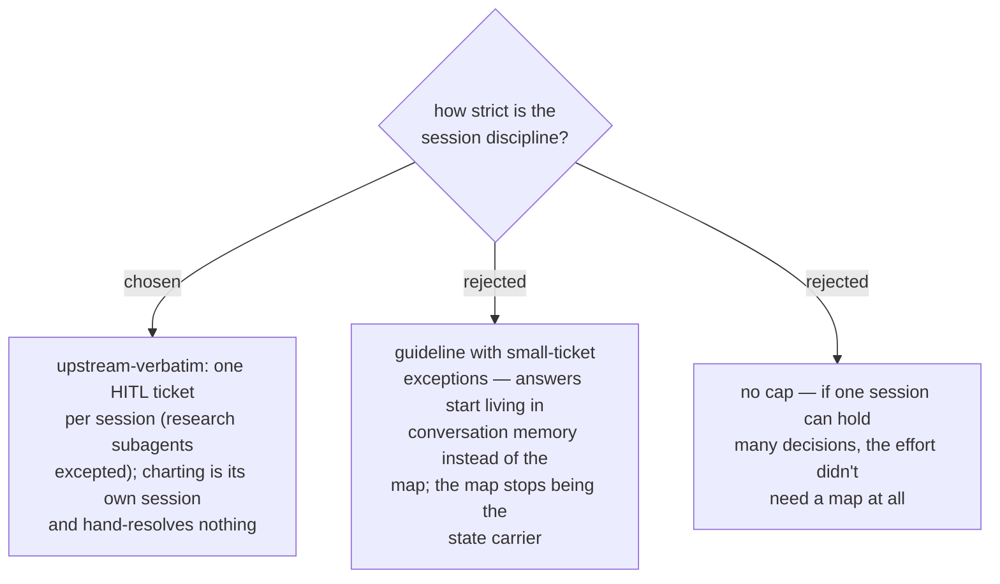

# ADR 0041 — decision-map adopts the one-ticket-per-session discipline verbatim

- **Status:** Accepted
- **Date:** 2026-07-31

The cap is what makes the map the **only** state carrier — the same "replay, don't
re-derive" principle ADR 0014 fixed for daily-state. The pull to resolve "just one
more" is redefined as a signal: either the frontier is genuinely small (the map is
nearly done) or the session is overreaching. `daily-state.md` may point at the
claimed ticket by name as its focus line, but the map and the tracker's
assignee/state fields remain the source of truth for effort progress.
