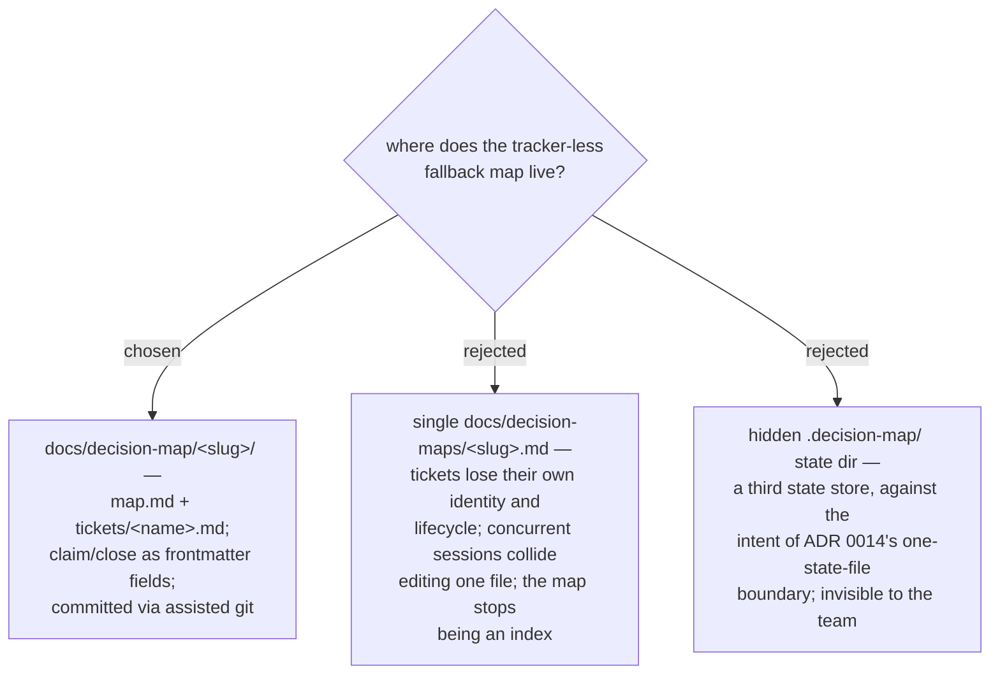

# ADR 0042 — the local-markdown map lives in `docs/decision-map/<slug>/`

- **Status:** Accepted
- **Date:** 2026-07-31

The fallback map sits on the **repo-docs side** of the ADR 0014 boundary: durable,
reviewable knowledge committed through assisted git — not a state file. One folder
per effort (`<slug>` = lowercase-kebab destination); `map.md` carries the map body
(Destination / Notes / Decisions so far / Not yet specified / Out of scope);
`tickets/<name>.md` gives each Decision ticket its own file, name, and lifecycle —
`status`, `assignee` (the claim), `blocks` as frontmatter, mutated only by the local
ops script (ADR 0037), so all three backends keep identical semantics.
