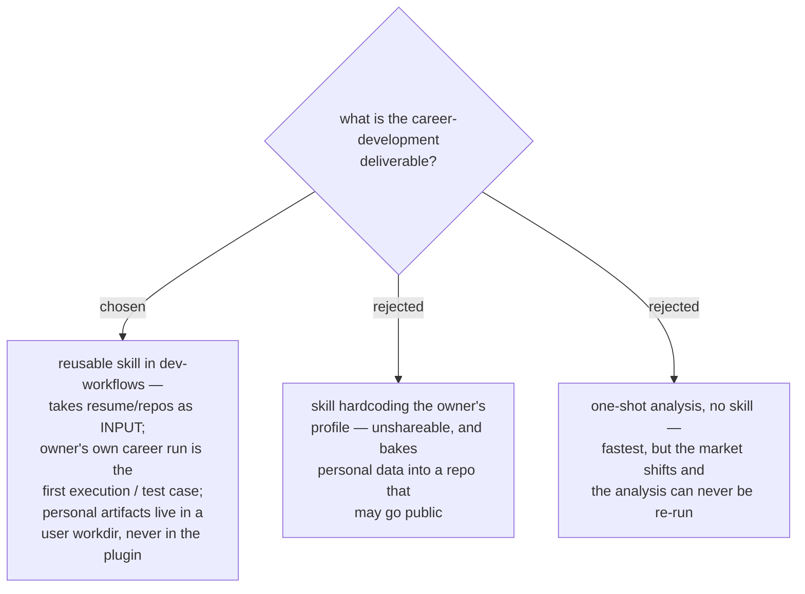

# ADR 0043 — career-growth ships as a reusable skill; personal data stays outside the plugin

- **Status:** Accepted
- **Date:** 2026-07-31

## Context

The owner wants a capability for developing their own professional skills toward
job-market fit and a defensible moat, with a ≥3-year horizon. The proposed pipeline
(inventory current skills → survey markets + certificates → present → guideline +
mini project) could be delivered as a personal analysis or as a marketplace skill.
Every existing dev-workflows skill is generic and takes the user's situation as
input; no skill embeds a person's data.

## Decision

Build it as a **reusable skill** in the `dev-workflows` plugin. The skill takes the
person's evidence (resume file, repo paths, and other sources) as **inputs** at run
time. Personal artifacts — the resume, analysis outputs, the growth plan — live in a
**user-chosen workdir outside the plugin**, mirroring how the backlog pipeline keeps
`findings.json` in a workdir. The owner's own career run is the skill's first
execution and acceptance test.

## Consequences

- ➕ Shareable with colleagues; the marketplace's existing conventions (PLAYBOOK row,
  diagram convention, ADRs) apply unchanged.
- ➕ No personal data in a repo that may be shared or public.
- ➕ Re-runnable as the market moves — the analysis is a function, not a snapshot.
- ➖ Slightly more design work: input contract and output location must be defined
  instead of assumed.
- Follow-ups this ADR does not settle: the skill's name, the pipeline stages, the
  moat definition, and the output document shape.
