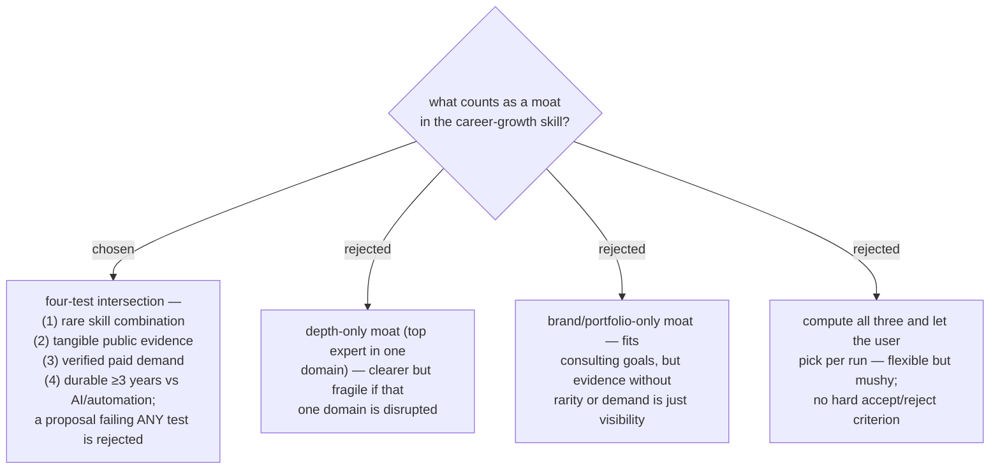

# ADR 0044 — a moat must pass all four tests: rare, evidenced, paid, durable

- **Status:** Accepted — **superseded in part by
  [ADR 0174](workflow-daily-work-0174-the-paid-test-requires-breadth-and-a-moat-sits-on-a-common-core.md)**:
  the four tests stand, but the `paid` test as worded here is too weak. It now
  means verified **and broad** — a floor of distinct employers across at least two
  rings — and every combination must name a broad core the market hires for on its
  own, with the rare edge on top. Rare counts people; nothing here counted employers.
- **Date:** 2026-07-31

## Context

The skill's stated goal is a defensible advantage ("จุดเด่นที่คนอื่นสู้ไม่ได้") with a
≥3-year horizon. Without an operational definition, the pipeline would emit generic
advice ("learn AI") indistinguishable from what everyone else is told. The definition
is the acceptance criterion for everything the gap-analysis and guideline stages
propose.

## Decision

**Moat** is defined as a skill combination that passes **all four tests**:

1. **Rare** — few people in the same target market hold the combination.
2. **Evidenced** — backed by tangible public proof (shipped repo, certificate,
   delivered work), not self-assessment.
3. **Paid** — demand is verified by real market signals (job postings, salary data),
   not assumed.
4. **Durable** — expected to survive ≥3 years against AI/automation absorption.

Any proposal the skill produces (target skill, certificate, mini project) must state
how it passes each test; failing one test disqualifies it as moat material (it may
still appear as a supporting skill, explicitly labeled as such).

## Consequences

- ➕ Hard, checkable criterion — every recommendation carries a four-line rationale.
- ➕ Kills generic advice by construction: "learn AI" fails the rarity test alone.
- ➖ Depth-only and brand-only strengths must be reframed as combinations (e.g. depth
  × domain, brand × niche) to qualify.
- The durability test needs a foresight method (trend sources, not just current job
  posts) — settled by a later ADR.
