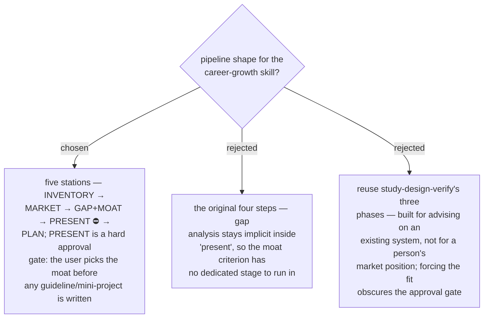

# ADR 0045 — career-growth runs five stations with an approval gate before planning

- **Status:** Accepted
- **Date:** 2026-07-31

## Context

The owner's proposal had four steps (inventory → market survey → present →
guideline + mini project). Two things were missing a home: the explicit comparison
between what the person has and what the market pays for (where the ADR 0044
four-test moat criterion actually runs), and a deliberate stop before the skill
starts prescribing a plan. The marketplace already treats deliberate stops before
consequential output as a first-class pattern (safety gates in the backlog
pipeline).

## Decision

The skill runs **five stations in order**:

1. **INVENTORY** — build the person's skill inventory from evidence sources.
2. **MARKET** — survey target job markets, matching certificates (live-verified),
   and 3-year trend signals.
3. **GAP + MOAT** — cross INVENTORY × MARKET; produce moat candidates, each argued
   against the four tests (ADR 0044).
4. **PRESENT** ⛔ — present candidates with evidence; the **user chooses the moat**.
   This is an approval gate: nothing downstream runs without an explicit pick.
5. **PLAN** — produce the guideline and mini projects for the chosen moat, plus the
   re-run checkpoint.

## Consequences

- ➕ The moat criterion has a dedicated stage; recommendations arrive argued, not
  asserted.
- ➕ The user owns the direction decision; the skill never self-selects a career
  path — mirroring the marketplace's approval-gate precedent.
- ➖ One more station to document and maintain than the original sketch.
- Station internals (input sources, market sources, output shapes) are settled by
  subsequent ADRs.
